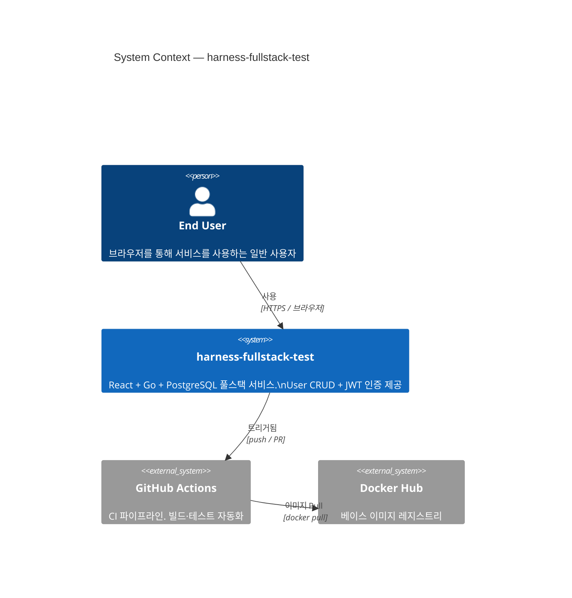
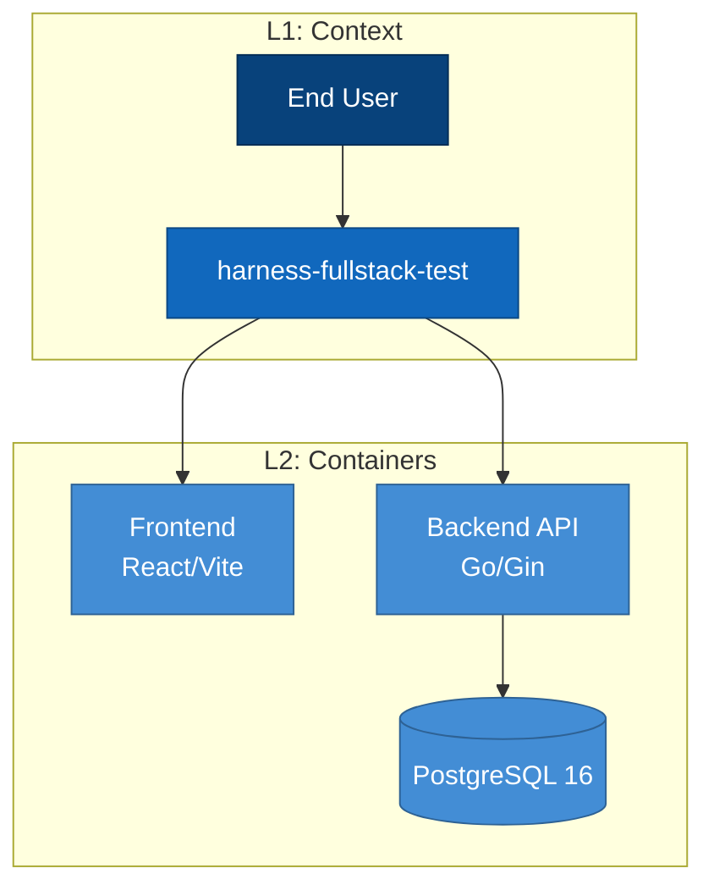

# Mermaid C4 패턴 참조

이 파일은 C4 모델의 세 레벨(Context, Container, Component)을 Mermaid로 표현하는
문법 패턴과 이 프로젝트 기준 예시를 제공한다.

---

## 전제: C4-PlantUML 라이브러리 선언

Mermaid 자체에는 C4 전용 키워드가 없다.
GitHub에서 렌더되는 C4 다이어그램은 `C4Context`, `C4Container`, `C4Component` 키워드를
첫 줄에 선언한 뒤, 아래 노드 패턴을 사용한다.

> **주의**: GitHub Mermaid 렌더러는 C4 문법을 지원한다 (2023년 이후).
> 지원하지 않는 환경에서는 `graph TB` + subgraph 조합으로 대체한다.

---

## L1 Context 다이어그램

**목적**: 시스템이 어떤 사용자와 어떤 외부 시스템과 상호작용하는지 보여준다.

### 노드 패턴



### 주요 키워드

| 키워드 | 역할 | 파라미터 |
|--------|------|---------|
| `Person(id, label, desc)` | 사람/액터 노드 | id: 내부 참조명, label: 표시명, desc: 설명 |
| `System(id, label, desc)` | 우리 시스템 | 경계 내부 시스템 |
| `System_Ext(id, label, desc)` | 외부 시스템 | 경계 외부 (회색 표시) |
| `Rel(from, to, label, tech)` | 단방향 관계 | tech: 프로토콜/기술 |
| `BiRel(a, b, label)` | 양방향 관계 | 자주 쓰지 않음 — 방향 명확히 할 것 |

---

## L2 Container 다이어그램

**목적**: 시스템 내부의 실행 단위(컨테이너)와 그 사이의 통신을 보여준다.
컨테이너 = 애플리케이션, 데이터베이스, 메시지 버스 등 독립 실행 단위.

```mermaid
C4Container
  title Container Diagram — harness-fullstack-test

  Person(endUser, "End User", "브라우저 사용자")

  System_Boundary(harnessSystem, "harness-fullstack-test") {
    Container(frontend, "Frontend", "React 18 / Vite / TypeScript",
      "SPA. 인증·CRUD UI. CSS Modules. React Router v6")
    Container(backend, "Backend API", "Go 1.22 / Gin",
      "RESTful API 서버. JWT 발급·검증. User CRUD 처리")
    ContainerDb(postgres, "PostgreSQL 16", "PostgreSQL",
      "사용자 데이터 영구 저장. users 테이블")
  }

  Rel(endUser, frontend, "접속", "HTTPS / 브라우저")
  Rel(frontend, backend, "API 호출", "HTTP/JSON (REST)")
  Rel(backend, postgres, "쿼리", "lib/pq / SQL")
```

### 주요 키워드

| 키워드 | 역할 |
|--------|------|
| `System_Boundary(id, label) { ... }` | 시스템 경계 박스 |
| `Container(id, label, tech, desc)` | 일반 컨테이너 (앱, 서버) |
| `ContainerDb(id, label, tech, desc)` | 데이터베이스 컨테이너 |
| `Container_Boundary(id, label) { ... }` | 컨테이너 하위 경계 (L3에서 사용) |

---

## L3 Component 다이어그램 — Backend

**목적**: Backend 컨테이너 내부의 Go 코드 모듈 구조를 보여준다.

```mermaid
C4Component
  title Component Diagram — Backend (Go/Gin)

  Container_Boundary(backend, "Backend API (Go/Gin)") {
    Component(router, "Router", "Gin Engine",
      "HTTP 라우트 등록. 미들웨어 체인 구성.\ncmd/server/main.go")
    Component(authMiddleware, "Auth Middleware", "Gin Middleware",
      "JWT 토큰 검증. Authorization 헤더 파싱.\ninternal/middleware/auth.go")
    Component(userHandler, "User Handler", "Gin Handler",
      "User CRUD HTTP 핸들러. 요청 바인딩·응답 직렬화.\ninternal/handler/user_handler.go")
    Component(userService, "User Service", "Go Service",
      "비즈니스 로직. bcrypt 해싱. JWT 발급.\ninternal/service/user_service.go")
    Component(userRepo, "User Repository", "Go Repository",
      "PostgreSQL 쿼리. lib/pq 사용.\ninternal/repository/user_repository.go")
    Component(models, "Domain Models", "Go Struct",
      "User, Request/Response DTO.\ninternal/model/user.go")
  }

  ContainerDb(postgres, "PostgreSQL 16", "PostgreSQL", "users 테이블")

  Rel(router, authMiddleware, "적용", "미들웨어 체인")
  Rel(router, userHandler, "라우팅", "GET/POST/PUT/DELETE /api/users")
  Rel(userHandler, userService, "호출", "서비스 레이어")
  Rel(userService, userRepo, "호출", "리포지토리 레이어")
  Rel(userRepo, postgres, "쿼리", "lib/pq / SQL")
  Rel(userHandler, models, "사용", "DTO 바인딩")
  Rel(userService, models, "사용", "도메인 모델")
```

---

## L3 Component 다이어그램 — Frontend

**목적**: Frontend 컨테이너 내부의 React 모듈 구조를 보여준다.

```mermaid
C4Component
  title Component Diagram — Frontend (React/Vite)

  Container_Boundary(frontend, "Frontend (React 18 / Vite)") {
    Component(router, "App Router", "React Router v6",
      "SPA 라우트 정의. ProtectedRoute 래핑.\nsrc/App.tsx")
    Component(authCtx, "AuthContext", "React Context",
      "JWT 토큰·사용자 상태 전역 관리. localStorage 연동.\nsrc/context/AuthContext.tsx")
    Component(loginPage, "LoginPage", "React Page",
      "로그인 폼. POST /api/auth/login 호출.\nsrc/pages/LoginPage.tsx")
    Component(usersPage, "UsersPage", "React Page",
      "사용자 목록·CRUD. GET/POST/PUT/DELETE /api/users 호출.\nsrc/pages/UsersPage.tsx")
    Component(apiClient, "API Client", "TypeScript Module",
      "fetch 래퍼. Authorization 헤더 자동 주입.\nsrc/api/client.ts")
    Component(types, "Type Definitions", "TypeScript",
      "User, ApiResponse 인터페이스.\nsrc/types/index.ts")
  }

  Container(backend, "Backend API", "Go/Gin", "REST API")

  Rel(router, authCtx, "제공", "Context Provider")
  Rel(router, loginPage, "렌더", "/login 라우트")
  Rel(router, usersPage, "렌더", "/users 라우트 (보호)")
  Rel(loginPage, apiClient, "호출", "POST /api/auth/login")
  Rel(usersPage, apiClient, "호출", "CRUD API")
  Rel(apiClient, backend, "HTTP", "JSON REST")
  Rel(apiClient, authCtx, "토큰 읽기", "JWT")
  Rel(loginPage, authCtx, "토큰 저장", "로그인 성공 시")
```

---

## classDef 레이어별 색상 구분

C4 다이어그램에 `graph TB` 대체 패턴을 사용할 때 색상으로 레이어를 구분한다.



### classDef 색상 표준 (C4 Blue Palette)

| 레이어 | fill | 용도 |
|--------|------|------|
| `#08427b` | 짙은 파랑 | Person (사람) |
| `#1168bd` | 파랑 | System (우리 시스템) |
| `#438dd5` | 밝은 파랑 | Container (실행 단위) |
| `#85bbf0` | 연한 파랑 | Component (코드 모듈) |
| `#999999` | 회색 | 외부 시스템/서비스 |

레이어별 색상 외에 `naming-conventions.md`의 색상 규칙도 병행 적용한다.
