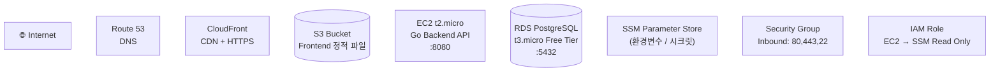
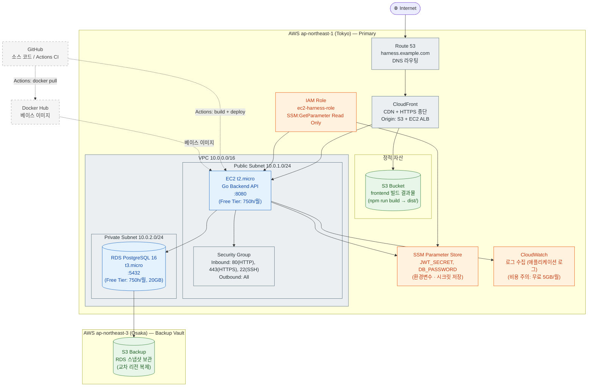
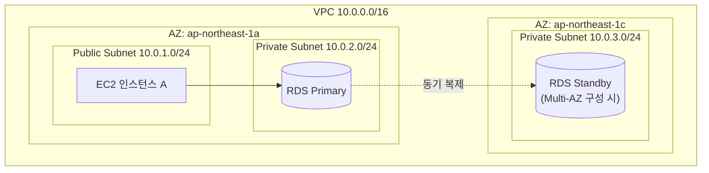

# Mermaid Deployment Diagram 패턴 참조

이 파일은 AWS Free Tier 배포 토폴로지를 Mermaid `flowchart` 문법으로
표현하는 패턴과 이 프로젝트 기준 예시를 제공한다.

---

## 기본 원칙

- **flowchart TB** (Top-Bottom): 인터넷 → CDN → 서버 → DB 순서로 시각화
- **subgraph**: VPC, Subnet, AZ(Availability Zone), 서비스 그룹을 표현
- **점선 `-.->` **: 외부 서비스(GitHub, Docker Hub) 참조
- **실선 `-->` **: 내부 트래픽 흐름
- **classDef**: compute/storage/network/security 레이어별 색상 구분

---

## 노드 모양 패턴



### Mermaid 노드 모양 대응

| 모양 | 문법 | 사용 상황 |
|------|------|---------|
| 직사각형 | `id["Label"]` | 서버, 서비스 |
| 원통형 (DB) | `id[("Label")]` | 데이터베이스, S3 |
| 마름모 | `id{"Label"}` | 의사결정, Load Balancer 조건 |
| 육각형 | `id{{"Label"}}` | 준비/대기 상태 |
| 스타디움 | `id(["Label"])` | 시작/종료 노드 |

---

## 이 프로젝트 기준: AWS Free Tier 배포 토폴로지



---

## subgraph로 VPC/Subnet/AZ 표현



---

## Free Tier 비용 주석

```
%% [비용 주석]
%% EC2 t2.micro: Free Tier 750h/월 (Linux)
%% RDS t3.micro: Free Tier 750h/월 + 20GB gp2
%% S3: Free Tier 5GB 저장 + GET 20,000건/월
%% CloudFront: Free Tier 1TB 전송/월 (12개월)
%% Route 53: 호스팅 존 $0.50/월 (Free Tier 없음 — 가장 저렴한 유료 서비스)
%% SSM Parameter Store: 표준 파라미터는 무료
%% CloudWatch: 무료 5GB 로그 수집/월 (초과 시 $0.50/GB)
%%
%% 주의: 모든 Free Tier는 계정 생성 후 12개월 한정
%% EC2/RDS는 인스턴스 운영 중 750h 이상이면 비용 발생
```

---

## classDef 색상 표준 (Deployment)

| 레이어 | fill | stroke | 용도 |
|--------|------|--------|------|
| compute | `#e3f2fd` | `#1565c0` | EC2, RDS, 컨테이너 |
| storage | `#e8f5e9` | `#2e7d32` | S3, EFS, 블록 스토리지 |
| network | `#eceff1` | `#546e7a` | Route53, CloudFront, SG, VPC |
| security | `#fff3e0` | `#e65100` | IAM, SSM, KMS, WAF |
| external | `#f5f5f5` | `#9e9e9e` | GitHub, Docker Hub (점선 테두리) |
