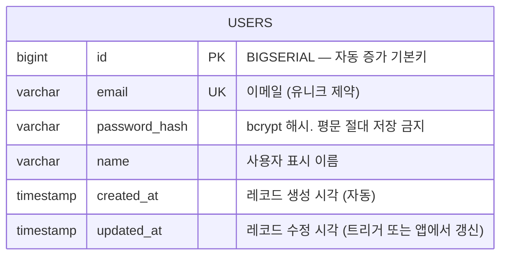
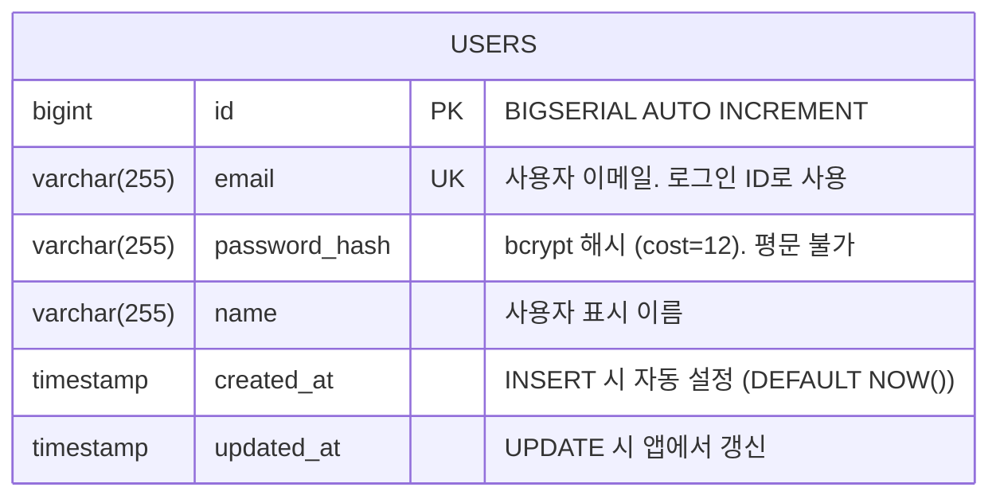
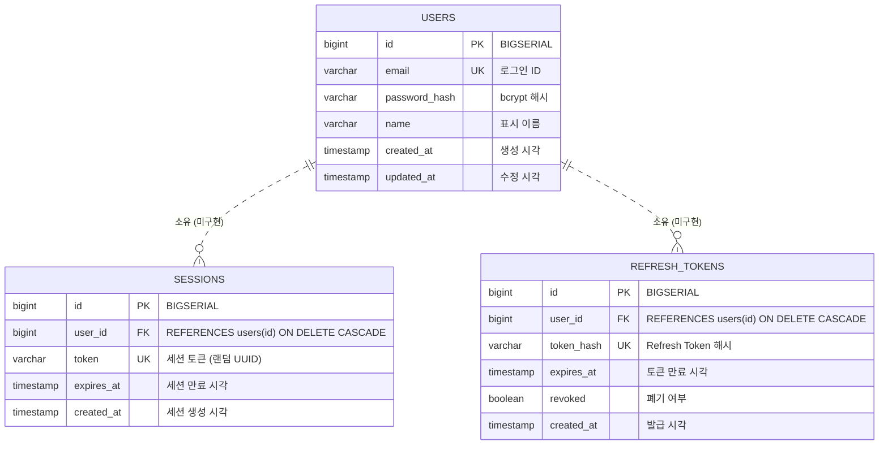

# Mermaid ER Diagram 패턴 참조

이 파일은 Mermaid `erDiagram`의 문법 패턴과
이 프로젝트의 PostgreSQL 스키마 예시를 제공한다.

---

## 기본 구조



---

## 속성 마커

| 마커 | 의미 | PostgreSQL 대응 |
|------|------|----------------|
| `PK` | Primary Key | `PRIMARY KEY` |
| `FK` | Foreign Key | `REFERENCES 다른테이블(id)` |
| `UK` | Unique Key | `UNIQUE` |
| (없음) | 일반 칼럼 | 제약 없음 |

---

## 관계 표현 문법

```
A ||--o{ B : "관계 설명"   (1:N — A는 정확히 1, B는 0 이상)
A ||--|{ B : "관계 설명"   (1:N — A는 정확히 1, B는 1 이상)
A |o--o{ B : "관계 설명"   (0~1 : 0~N)
A }|--|{ B : "관계 설명"   (N:M — 양쪽 1 이상)
A ||..o{ B : "관계 설명"   (점선: 비식별 관계 / 선택적)
```

| 기호 | 의미 |
|------|------|
| `\|\|` | 정확히 1 (exactly one) |
| `\|o` | 0 또는 1 (zero or one) |
| `o{` | 0 이상 (zero or more) |
| `\|{` | 1 이상 (one or more) |
| `--` | 실선 (식별 관계) |
| `..` | 점선 (비식별 / 선택적 관계) |

---

## 이 프로젝트 기준: 현재 스키마 (MVP)

현재 구현된 테이블은 `users` 하나다.



**PostgreSQL DDL 대응:**

```sql
-- backend/migrations/001_create_users.sql (또는 동등한 초기화 SQL)
CREATE TABLE IF NOT EXISTS users (
    id          BIGSERIAL PRIMARY KEY,
    email       VARCHAR(255) NOT NULL UNIQUE,
    password_hash VARCHAR(255) NOT NULL,
    name        VARCHAR(255) NOT NULL,
    created_at  TIMESTAMP NOT NULL DEFAULT NOW(),
    updated_at  TIMESTAMP NOT NULL DEFAULT NOW()
);
```

---

## 향후 확장 예시 (미구현 — 주석/점선으로 표시)

아직 구현하지 않은 테이블은 `erDiagram`에서 점선 관계(`..`)로 표시하거나
주석으로 명시하여 "계획된 확장"임을 학습자에게 전달한다.



---

## 코드 매핑 — ER 노드 ↔ 실제 파일

| ER 엔티티 | 실제 파일 경로 | 주요 구조체/쿼리 |
|----------|-------------|---------------|
| `USERS` (전체) | `backend/internal/model/user.go` | `type User struct` |
| `USERS.id` | `backend/internal/model/user.go` | `ID int64 \`json:"id"\`` |
| `USERS.email` | `backend/internal/model/user.go` | `Email string \`json:"email"\`` |
| `USERS.password_hash` | `backend/internal/model/user.go` | `PasswordHash string \`json:"-"\`` (응답 직렬화 제외) |
| `USERS` INSERT | `backend/internal/repository/user_repository.go` | `Create(user)` |
| `USERS` SELECT (단건) | `backend/internal/repository/user_repository.go` | `FindByID(id)`, `FindByEmail(email)` |
| `USERS` SELECT (목록) | `backend/internal/repository/user_repository.go` | `FindAll()` |
| `USERS` UPDATE | `backend/internal/repository/user_repository.go` | `Update(user)` |
| `USERS` DELETE | `backend/internal/repository/user_repository.go` | `Delete(id)` |
| 프론트 타입 대응 | `frontend/src/types/index.ts` | `interface User` |

---

## 학습 포인트

### password_hash 칼럼 설계 의도
- `json:"-"` 태그로 API 응답에서 해시 제외
- bcrypt는 단방향 해시 — 원문 복구 불가
- 비교 시 `bcrypt.CompareHashAndPassword()` 사용 (상수 시간 비교)

### created_at / updated_at 관리
- `created_at`: `DEFAULT NOW()` — DB 레벨에서 자동 설정
- `updated_at`: 앱 레벨에서 `time.Now()` 명시 설정 (트리거 없음)
- Go `time.Time` ↔ PostgreSQL `TIMESTAMP` 직렬화: `lib/pq` 가 처리

### email UNIQUE 제약
- DB 레벨 유니크 제약 + 서비스 레이어 중복 체크 이중 보호
- 동시성 환경에서 DB 레벨 제약이 최후 방어선
