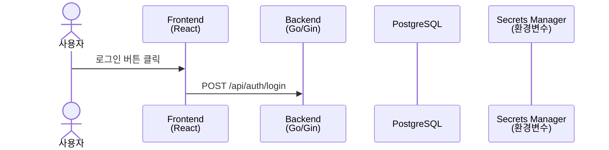
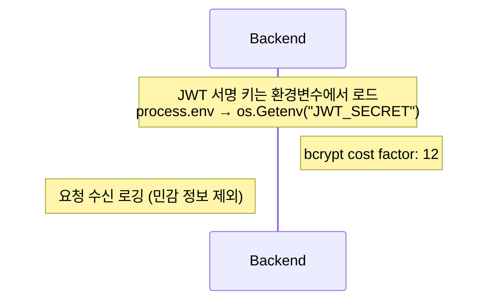
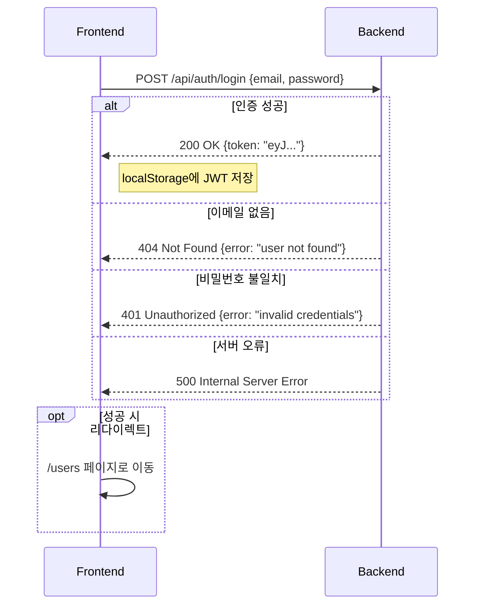
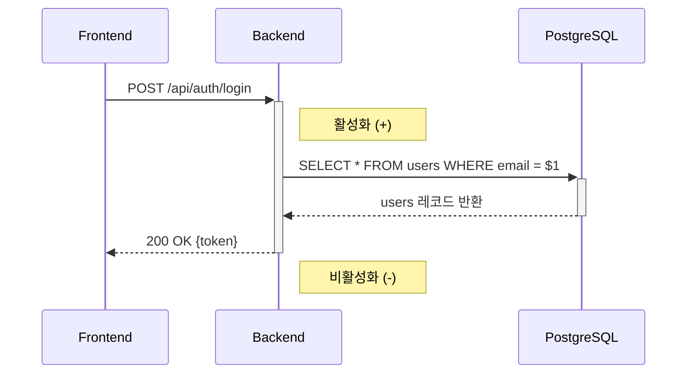

# Mermaid Sequence Diagram 패턴 참조

이 파일은 Mermaid `sequenceDiagram`의 문법 패턴과
이 프로젝트의 JWT 인증 플로우 예시를 제공한다.

---

## 기본 구조



---

## actor vs participant

| 키워드 | 렌더 | 사용 상황 |
|--------|------|---------|
| `actor` | 사람 아이콘 | 실제 사용자 |
| `participant` | 직사각형 박스 | 시스템·서비스·컴포넌트 |

---

## 화살표 종류

| 문법 | 의미 | 사용 상황 |
|------|------|---------|
| `A->>B: 메시지` | 실선 화살표 (동기 요청) | 일반 함수 호출, HTTP 요청 |
| `A-->>B: 메시지` | 점선 화살표 (응답) | HTTP 응답, 반환값 |
| `A-)B: 메시지` | 비동기 화살표 | 이벤트, 메시지 큐 |
| `A-xB: 메시지` | X 화살표 (실패) | 에러, 거부 |

---

## Note 사용법



- `Note over A,B:` — A와 B 사이에 걸쳐 표시
- `Note right of A:` — A 오른쪽에 표시
- `Note left of A:` — A 왼쪽에 표시

---

## alt / opt 분기 패턴



- `alt`: 상호 배타적 분기 (if-else)
- `opt`: 조건부 실행 (if only, else 없음)
- `loop`: 반복 (`loop 재시도 3회`)
- `par`: 병렬 실행 (`par 병렬 작업 A` ... `and 병렬 작업 B`)

---

## activate / deactivate 패턴

실행 중인 참여자를 시각적으로 강조할 때 사용한다.
활성화된 참여자는 긴 수직 막대로 표시된다.



---

## 이 프로젝트 기준: JWT 로그인 전체 플로우

이 시퀀스는 `docs/architecture/sequence-auth-flow.md`의 내용과 동일하다.
패턴 학습용 참조본으로 여기에도 포함한다.

```mermaid
sequenceDiagram
  actor User as 사용자
  participant FE as Frontend<br/>(React/Vite)
  participant BE as Backend<br/>(Go/Gin)
  participant DB as PostgreSQL
  participant ENV as 환경변수<br/>(JWT_SECRET)

  %% --- 로그인 요청 ---
  User->>FE: 이메일 + 비밀번호 입력 후 로그인 버튼 클릭
  activate FE
  FE->>+BE: POST /api/auth/login<br/>Body: {email, password}
  deactivate FE

  %% --- 백엔드 처리 ---
  activate BE
  BE->>ENV: os.Getenv("JWT_SECRET") 조회
  ENV-->>BE: JWT 서명 키 반환
  BE->>+DB: SELECT id, email, password_hash, name<br/>FROM users WHERE email = $1
  DB-->>-BE: 사용자 레코드 반환 (없으면 404)

  alt 사용자 존재
    BE->>BE: bcrypt.CompareHashAndPassword()<br/>password_hash vs 입력 비밀번호 검증
    alt bcrypt 일치
      BE->>BE: jwt.NewWithClaims(HS256)<br/>Payload: {user_id, email, exp}
      BE-->>FE: 200 OK<br/>Body: {token: "eyJhbGciOiJIUzI1NiJ9..."}
      deactivate BE
      FE->>FE: localStorage.setItem("token", token)
      FE->>User: /users 페이지로 리다이렉트
    else bcrypt 불일치
      BE-->>FE: 401 Unauthorized<br/>Body: {error: "invalid credentials"}
      deactivate BE
      FE->>User: 에러 메시지 표시
    end
  else 사용자 없음
    BE-->>FE: 404 Not Found<br/>Body: {error: "user not found"}
    deactivate BE
    FE->>User: 에러 메시지 표시
  end

  %% --- 인증된 API 호출 ---
  Note over User,DB: 로그인 성공 후 보호된 API 호출 흐름

  User->>FE: 사용자 목록 페이지 접근
  FE->>FE: localStorage.getItem("token") 조회
  FE->>+BE: GET /api/users<br/>Header: Authorization: Bearer eyJhbGci...
  activate BE
  BE->>BE: AuthMiddleware: jwt.ParseWithClaims()<br/>토큰 서명 검증 + 만료 확인
  alt 토큰 유효
    BE->>+DB: SELECT id, email, name, created_at<br/>FROM users ORDER BY id
    DB-->>-BE: users 배열 반환
    BE-->>-FE: 200 OK<br/>Body: [{id, email, name, created_at}, ...]
    deactivate BE
    FE->>User: 사용자 목록 렌더링
  else 토큰 만료/무효
    BE-->>FE: 401 Unauthorized
    deactivate BE
    FE->>FE: localStorage.removeItem("token")
    FE->>User: /login 으로 리다이렉트
  end
```

---

## 코드 매핑 — 시퀀스 노드 ↔ 실제 파일

| 시퀀스 노드 | 실제 파일 경로 | 주요 함수/코드 |
|------------|-------------|--------------|
| FE: POST /api/auth/login | `frontend/src/api/client.ts` | `login(email, password)` |
| FE: localStorage.setItem | `frontend/src/context/AuthContext.tsx` | `login()` 내부 |
| BE: POST /api/auth/login | `backend/internal/handler/user_handler.go` | `Login()` |
| BE: os.Getenv("JWT_SECRET") | `backend/internal/service/user_service.go` | `GenerateToken()` 내 |
| BE: bcrypt.CompareHashAndPassword | `backend/internal/service/user_service.go` | `Login()` |
| BE: jwt.NewWithClaims | `backend/internal/service/user_service.go` | `GenerateToken()` |
| DB: SELECT users | `backend/internal/repository/user_repository.go` | `FindByEmail()` |
| BE: AuthMiddleware | `backend/internal/middleware/auth.go` | `AuthRequired()` |
| BE: jwt.ParseWithClaims | `backend/internal/middleware/auth.go` | `AuthRequired()` 내부 |
| BE: GET /api/users | `backend/internal/handler/user_handler.go` | `GetUsers()` |
