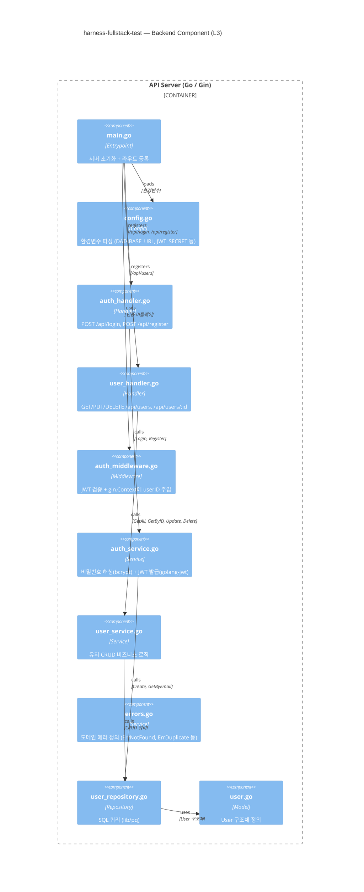

# Backend Component Diagram (C4 Level 3)

<!-- 
  역할: Go(Gin) 백엔드의 레이어 구조를 시각화하는 C4 L3 다이어그램 wrapper
  시스템 내 위치: docs/architecture/ — Container(L2)에서 API Server 컨테이너를 zoom-in한 뷰
  관련 파일: component-backend.mmd (순수 Mermaid 소스), container.md (상위), component-frontend.md (형제)
  설계 의도: Handler → Service → Repository 3층 구조를 시각화하여,
            각 레이어의 책임 분리(SRP)와 의존 방향을 명확히 한다.
-->

## 이 다이어그램이 설명하는 것

Go(Gin) 백엔드의 레이어 구조를 보여준다. Handler → Service → Repository 패턴을 따르며, Middleware가 인증을 횡단 관심사로 처리한다.

## 코드 매핑

<!-- 각 컴포넌트가 실제 백엔드 소스 파일의 어디에 대응하는지를 정리한다.
     Go 패키지 구조와 파일 경로를 1:1로 매핑한다. -->

| 다이어그램 노드 | 실제 파일 경로 | 주요 함수/컴포넌트 |
|---------------|-------------|----------------|
| main.go | `backend/cmd/server/main.go` | main() |
| config.go | `backend/internal/config/config.go` | Load() |
| auth_handler.go | `backend/internal/handler/auth_handler.go` | Login(), Register() |
| user_handler.go | `backend/internal/handler/user_handler.go` | GetAll(), GetByID(), Update(), Delete() |
| auth_middleware.go | `backend/internal/middleware/auth_middleware.go` | AuthMiddleware() |
| auth_service.go | `backend/internal/service/auth_service.go` | Login(), Register() |
| user_service.go | `backend/internal/service/user_service.go` | GetAll(), GetByID(), Update(), Delete() |
| errors.go | `backend/internal/service/errors.go` | ErrNotFound, ErrDuplicate |
| user_repository.go | `backend/internal/repository/user_repository.go` | Create(), GetByEmail(), GetAll() 등 |
| user.go | `backend/internal/model/user.go` | User struct |

## 다이어그램

<!-- component-backend.mmd 파일의 내용을 그대로 삽입한다. -->

## 왜 이 구조인가 (설계 의도)

<!-- 3층 구조, Middleware 분리, 도메인 에러의 "왜"를 설명한다. -->

- Handler → Service → Repository 3층 구조: 각 레이어가 하나의 책임만 가지며(SRP), 테스트 시 하위 레이어를 교체 가능
- Middleware로 JWT 검증을 분리하여 각 Handler가 인증 로직을 반복하지 않음
- Service 레이어에 도메인 에러를 정의하여 Handler가 HTTP 상태 코드로 변환하는 책임만 가짐

## 관련 학습 포인트

<!-- 백엔드 아키텍처에서 학습할 수 있는 핵심 개념들. -->

- **Layered Architecture**: Presentation(Handler) → Business(Service) → Data(Repository)
- **Gin의 middleware chain**: 요청 → CORS → Auth → Handler → 응답
- **bcrypt의 단방향 해싱**: password_hash에서 원본 비밀번호를 복원할 수 없음
