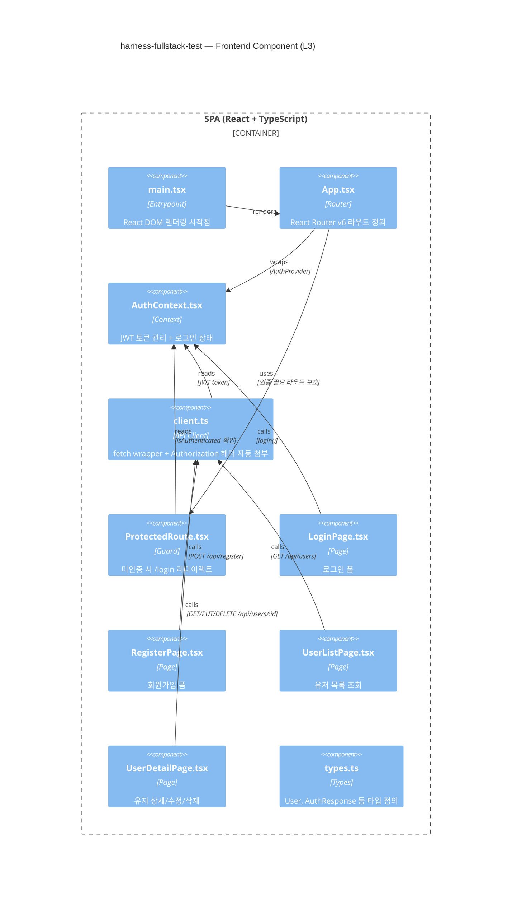

# Frontend Component Diagram (C4 Level 3)

<!-- 
  역할: React SPA 내부의 컴포넌트 구조를 시각화하는 C4 L3 다이어그램 wrapper
  시스템 내 위치: docs/architecture/ — Container(L2)에서 SPA 컨테이너를 zoom-in한 뷰
  관련 파일: component-frontend.mmd (순수 Mermaid 소스), container.md (상위), component-backend.md (형제)
  설계 의도: 프론트엔드의 라우팅/인증/API호출/페이지 간 의존 관계를 명시하여,
            React 앱의 데이터 흐름을 한눈에 파악할 수 있게 한다.
-->

## 이 다이어그램이 설명하는 것

React SPA 내부의 컴포넌트 구조를 보여준다. 라우팅, 인증 상태 관리, API 호출, 페이지 간의 의존 관계를 시각화한다.

## 코드 매핑

<!-- 각 컴포넌트가 실제 프론트엔드 소스 파일의 어디에 대응하는지를 정리한다.
     학습자가 다이어그램의 박스를 보고 바로 코드를 찾을 수 있게 한다. -->

| 다이어그램 노드 | 실제 파일 경로 | 주요 함수/컴포넌트 |
|---------------|-------------|----------------|
| main.tsx | `frontend/src/main.tsx` | ReactDOM.createRoot() |
| App.tsx | `frontend/src/App.tsx` | Routes 정의 |
| AuthContext.tsx | `frontend/src/context/AuthContext.tsx` | AuthProvider, useAuth() |
| client.ts | `frontend/src/api/client.ts` | apiFetch() |
| ProtectedRoute.tsx | `frontend/src/components/ProtectedRoute.tsx` | ProtectedRoute |
| LoginPage.tsx | `frontend/src/pages/LoginPage.tsx` | LoginPage |
| RegisterPage.tsx | `frontend/src/pages/RegisterPage.tsx` | RegisterPage |
| UserListPage.tsx | `frontend/src/pages/UserListPage.tsx` | UserListPage |
| UserDetailPage.tsx | `frontend/src/pages/UserDetailPage.tsx` | UserDetailPage |
| types.ts | `frontend/src/types.ts` | User, AuthResponse |

## 다이어그램

<!-- component-frontend.mmd 파일의 내용을 그대로 삽입한다. -->

## 왜 이 구조인가 (설계 의도)

<!-- 인증 상태 관리, 라우트 보호, API 클라이언트 분리의 "왜"를 설명한다. -->

- AuthContext가 최상위에서 인증 상태를 관리하여 모든 하위 컴포넌트가 동일한 토큰에 접근 가능
- ProtectedRoute로 인증 분기를 라우트 레벨에서 처리하여 각 페이지가 인증 로직을 반복하지 않음 (DRY)
- API client가 AuthContext에서 토큰을 읽어 자동으로 Authorization 헤더를 붙이므로, 각 페이지는 인증 세부사항을 몰라도 됨

## 관련 학습 포인트

<!-- 프론트엔드 아키텍처에서 학습할 수 있는 핵심 개념들. -->

- **React Context API**: props drilling 없이 전역 상태를 공유하는 패턴
- **Protected Route 패턴**: SPA에서 미인증 사용자의 접근을 가드하는 표준 방법
- **관심사 분리**: pages/(UI) / context/(상태) / api/(통신) / types/(타입)
