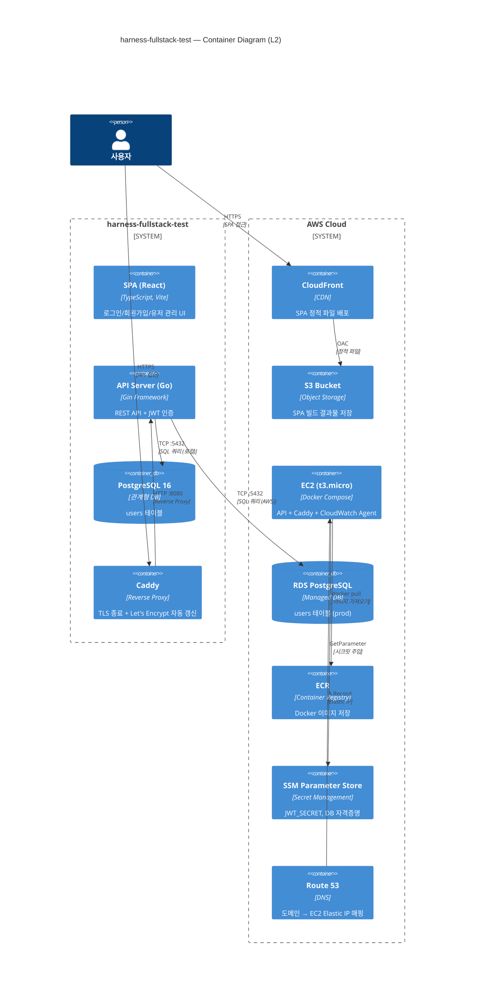

# Container Diagram (C4 Level 2)

<!-- 
  역할: 시스템 내부의 실행 단위(Container)를 시각화하는 C4 L2 다이어그램 wrapper
  시스템 내 위치: docs/architecture/ — Context(L1)에서 한 단계 zoom-in한 뷰
  관련 파일: container.mmd (순수 Mermaid 소스), context.md (상위), component-*.md (하위)
  설계 의도: 로컬(Docker Compose)과 AWS 환경 모두의 실행 단위를 하나의 다이어그램에 표시하여,
            "로컬에서 되면 클라우드에서도 된다"는 환경 동형성을 시각적으로 보여준다.
-->

## 이 다이어그램이 설명하는 것

시스템 내부의 실행 단위(Container)를 보여준다. 로컬(Docker Compose)과 AWS 환경에서 어떤 컨테이너/서비스가 어떤 역할을 하는지, 그리고 서로 어떻게 통신하는지를 나타낸다.

## 코드 매핑

<!-- 각 컨테이너/서비스가 실제 코드베이스의 어디에 대응하는지를 정리한다.
     로컬 환경과 AWS 환경 모두 포함하여 1:1 매핑을 가시화한다. -->

| 다이어그램 노드 | 실제 파일 경로 | 주요 함수/컴포넌트 |
|---------------|-------------|----------------|
| SPA (React) | `frontend/src/` | App.tsx, pages/ |
| API Server (Go) | `backend/cmd/server/main.go` | main(), router setup |
| PostgreSQL | `docker-compose.yml` → db service | -- |
| Caddy | `infra/aws-cdk/lib/ec2-app-stack.ts` | User Data 내 Caddy 설정 |
| CloudFront | `infra/aws-cdk/lib/frontend-stack.ts` | FrontendStack |
| S3 Bucket | `infra/aws-cdk/lib/frontend-stack.ts` | S3 bucket 생성 |
| EC2 | `infra/aws-cdk/lib/ec2-app-stack.ts` | Ec2AppStack |
| RDS | `infra/aws-cdk/lib/database-stack.ts` | DatabaseStack |
| ECR | `infra/aws-cdk/lib/ec2-app-stack.ts` | ECR repository |
| SSM | `infra/aws-cdk/lib/ec2-app-stack.ts` | SSM parameter |
| Route 53 | `infra/aws-cdk/lib/ec2-app-stack.ts` | A Record |

## 다이어그램

<!-- container.mmd 파일의 내용을 그대로 삽입한다. -->

## 왜 이 구조인가 (설계 의도)

<!-- 로컬↔클라우드 동형성, Caddy 선택 이유, ECR+SSM 도입 이유를 설명한다. -->

- 로컬(Docker Compose)과 클라우드(AWS)의 1:1 매핑을 명시하여 "로컬에서 되면 클라우드에서도 된다"는 확신을 준다
- Caddy를 TLS reverse proxy로 선택한 이유: Let's Encrypt 자동 갱신이 기본 내장, 설정이 간결, ALB 비용 절감
- ECR + SSM을 통한 이미지/시크릿 관리로 Docker Hub 의존성과 평문 시크릿을 제거한다

## 관련 학습 포인트

<!-- Container 레벨에서 학습할 수 있는 핵심 개념들. -->

- **C4 Container**: "독립적으로 배포 가능한 단위"의 의미 -- SPA와 API는 별도 빌드/배포 단위
- 로컬 vs 클라우드 환경에서 같은 docker-compose.yml을 재사용하는 패턴
- **OAC(Origin Access Control)**: S3 bucket을 public으로 열지 않고 CloudFront를 통해서만 접근 허용
