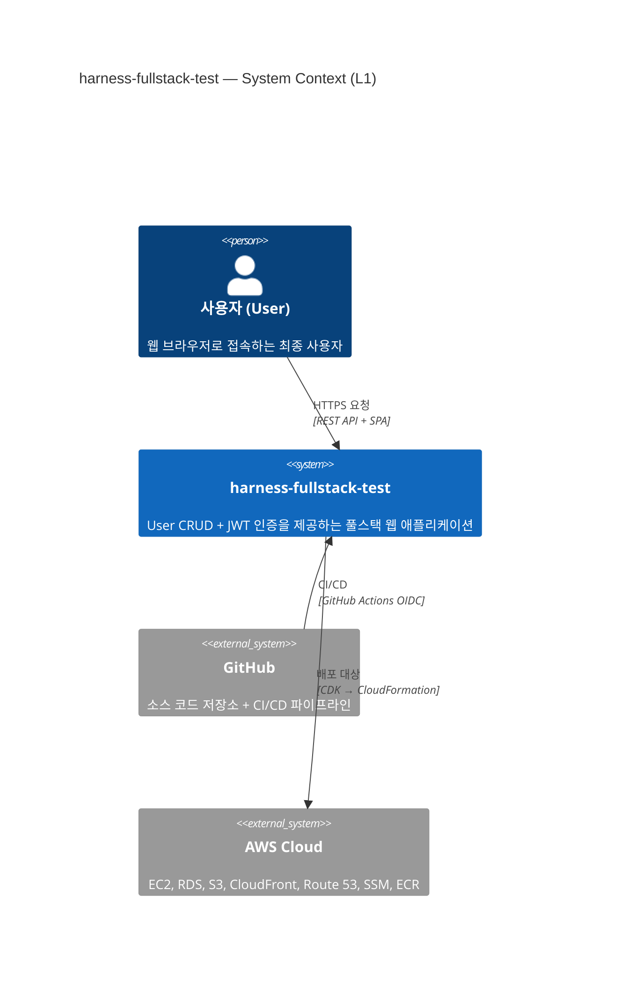

# System Context Diagram (C4 Level 1)

<!-- 
  역할: harness-fullstack-test 시스템의 최상위 경계(Context)를 시각화하는 C4 L1 다이어그램 wrapper
  시스템 내 위치: docs/architecture/ — 다이어그램 문서 중 가장 상위 추상화 레벨
  관련 파일: context.mmd (순수 Mermaid 소스), container.md (한 단계 하위 zoom-in)
  설계 의도: C4 Model의 "밖에서 안으로" 접근법에 따라 최상위 뷰를 먼저 제공하여,
            학습자가 전체 그림을 파악한 후 Container → Component로 내려가도록 유도한다.
-->

## 이 다이어그램이 설명하는 것

harness-fullstack-test 시스템의 최상위 경계를 보여준다. 사용자, 외부 시스템(GitHub, AWS)과의 관계를 한 눈에 파악할 수 있다.

## 코드 매핑

<!-- 다이어그램의 각 노드가 실제 코드베이스의 어디에 대응하는지를 표로 정리한다.
     학습자가 "이 박스는 실제로 어떤 파일인가?"를 즉시 추적할 수 있게 한다. -->

| 다이어그램 노드 | 실제 파일 경로 | 주요 함수/컴포넌트 |
|---------------|-------------|----------------|
| harness-fullstack-test | 프로젝트 전체 | -- |
| GitHub | `.github/workflows/ci.yml` | CI 파이프라인 |
| AWS Cloud | `infra/aws-cdk/` | CDK Stack 정의 |

## 다이어그램

<!-- context.mmd 파일의 내용을 그대로 삽입한다.
     GitHub에서 이 .md 파일을 열면 Mermaid가 자동 렌더링된다. -->

## 왜 이 구조인가 (설계 의도)

<!-- 단순히 "무엇"이 아니라 "왜 이렇게 했는지"를 설명하여 학습 효과를 극대화한다. -->

- C4 Context는 "이 시스템이 무엇이고 누구와 상호작용하는가"를 비개발자에게도 설명할 수 있는 최상위 뷰이다
- 외부 의존성(AWS, GitHub)을 명시하여 시스템 경계를 분명히 한다
- 학습자가 전체 그림을 먼저 파악한 후 하위 레벨로 내려가도록 유도한다

## 관련 학습 포인트

<!-- 이 다이어그램을 통해 학습할 수 있는 핵심 개념들을 정리한다. -->

- **C4 Model**: Context → Container → Component → Code 의 4단계 zoom-in 접근법
- **System Boundary**: 우리가 제어하는 범위 vs 외부에 의존하는 범위의 구분
- 이 다이어그램에서 AWS는 "외부 시스템"이지만, deployment 다이어그램에서는 내부 구성 요소로 확장된다
