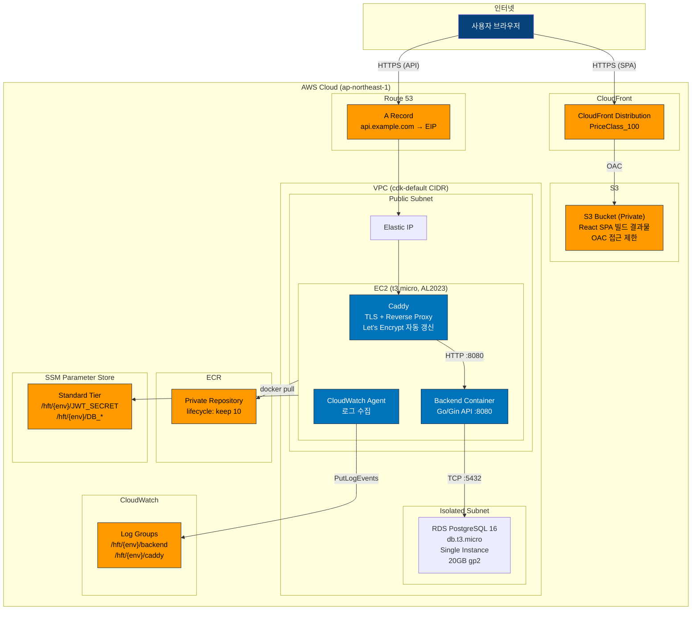

# AWS Deployment Diagram

<!-- 
  역할: AWS Free Tier 범위의 배포 토폴로지를 시각화하는 다이어그램 wrapper
  시스템 내 위치: docs/architecture/ — C4 Container(L2)에서 AWS 인프라를 zoom-in한 운영 관점 뷰
  관련 파일: deployment-aws.mmd (순수 Mermaid 소스), container.md (논리적 상위 뷰)
  설계 의도: VPC, 서브넷, EC2, RDS 등 AWS 리소스의 물리적 배치와 통신 경로를 보여주어,
            "코드가 어디서 어떻게 실행되는가"를 인프라 관점에서 이해할 수 있게 한다.
-->

## 이 다이어그램이 설명하는 것

AWS Free Tier 범위에서의 배포 토폴로지를 보여준다. 단일 EC2에 Docker Compose로 백엔드를 실행하고, S3+CloudFront로 프론트엔드를 배포한다.

## 코드 매핑

<!-- 각 AWS 리소스가 CDK 코드의 어디에서 정의되는지를 매핑한다.
     학습자가 다이어그램의 인프라 박스를 보고 IaC 코드를 바로 찾을 수 있게 한다. -->

| 다이어그램 노드 | 실제 파일 경로 | 주요 함수/컴포넌트 |
|---------------|-------------|----------------|
| VPC | `infra/aws-cdk/lib/network-stack.ts` | NetworkStack |
| EC2 + Docker Compose | `infra/aws-cdk/lib/ec2-app-stack.ts` | Ec2AppStack |
| RDS PostgreSQL | `infra/aws-cdk/lib/database-stack.ts` | DatabaseStack |
| CloudFront + S3 | `infra/aws-cdk/lib/frontend-stack.ts` | FrontendStack |
| CloudWatch Logs | `infra/aws-cdk/lib/observability-stack.ts` | ObservabilityStack |
| Route 53 | `infra/aws-cdk/lib/ec2-app-stack.ts` | Route53 A Record |
| Elastic IP | `infra/aws-cdk/lib/ec2-app-stack.ts` | CfnEIP |
| ECR | `infra/aws-cdk/lib/ec2-app-stack.ts` | Repository |
| SSM | `infra/aws-cdk/lib/ec2-app-stack.ts` | StringParameter |

## 다이어그램

<!-- deployment-aws.mmd 파일의 내용을 그대로 삽입한다. -->

## 왜 이 구조인가 (설계 의도)

<!-- Free Tier 최적화, 단일 EC2, Isolated Subnet의 "왜"를 설명한다. -->

- **Free Tier 최적화**: ALB($16/월) 대신 Caddy(무료), NAT Gateway($32/월) 대신 public subnet, Secrets Manager($0.40/secret/월) 대신 SSM Parameter Store(무료)
- **단일 EC2**: 학습용이므로 HA 불필요. 배포 시 brief downtime 허용 (Stage 2에서 ASG로 전환 경로 있음)
- **Isolated Subnet에 RDS**: DB는 퍼블릭 인터넷에서 직접 접근 불가. EC2에서만 접근 가능

## 관련 학습 포인트

<!-- AWS 인프라 설계에서 학습할 수 있는 핵심 개념들. -->

- **VPC 서브넷 설계**: public(인터넷 접근 가능) vs isolated(인터넷 차단) -- private은 NAT 필요하므로 Free Tier에서 제외
- **Let's Encrypt + Caddy**: 무료 TLS 인증서 자동 발급/갱신. ALB의 ACM 대안
- **EC2 User Data**: 인스턴스 최초 부팅 시 자동 실행되는 초기화 스크립트
- **SSM Session Manager**: SSH 없이 EC2에 접속하는 AWS 기본 기능 (22번 포트 불필요)
