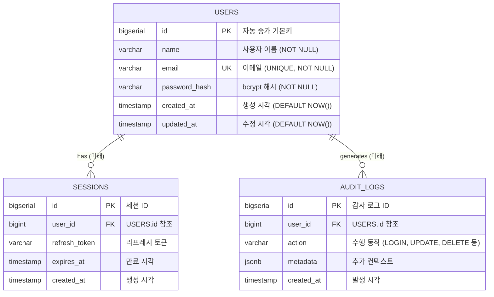

# ER (Entity-Relationship) Diagram

<!-- 
  역할: 데이터베이스 스키마(현재 + 향후 확장 지점)를 시각화하는 ER 다이어그램 wrapper
  시스템 내 위치: docs/architecture/ — 데이터 모델 관점의 정적 뷰
  관련 파일: er-schema.mmd (순수 Mermaid 소스), component-backend.md (Repository 레이어와 연결)
  설계 의도: MVP의 최소 스키마(users)와 향후 확장 지점(sessions, audit_logs)을 동시에 표시하여,
            현재 구현 범위와 진화 방향을 한눈에 파악할 수 있게 한다.
-->

## 이 다이어그램이 설명하는 것

현재 데이터베이스 스키마(users 테이블)와 향후 확장 지점(sessions, audit_logs)을 보여준다.

## 코드 매핑

<!-- 각 엔티티가 실제 SQL 마이그레이션/모델 파일의 어디에 대응하는지를 정리한다. -->

| 다이어그램 노드 | 실제 파일 경로 | 주요 함수/컴포넌트 |
|---------------|-------------|----------------|
| USERS | `backend/migrations/001_create_users.sql` | CREATE TABLE users |
| USERS (rename) | `backend/migrations/002_rename_password_to_hash.sql` | ALTER TABLE |
| User struct | `backend/internal/model/user.go` | type User struct |
| SESSIONS (미래) | -- | refresh token 도입 시 |
| AUDIT_LOGS (미래) | -- | 감사 로깅 도입 시 |

## 다이어그램

<!-- er-schema.mmd 파일의 내용을 그대로 삽입한다. -->

## 왜 이 구조인가 (설계 의도)

<!-- MVP 최소 스키마, password_hash 네이밍, 향후 확장 지점 표시의 "왜"를 설명한다. -->

- MVP이므로 users 테이블 하나만 구현. 불필요한 테이블을 미리 만들지 않음 (YAGNI)
- password_hash로 컬럼명을 변경하여 "이것은 해시값이지 원본 비밀번호가 아님"을 명시 (migration 002)
- 향후 확장 지점을 다이어그램에만 표시하여, 실제 코드 없이도 진화 방향을 파악할 수 있게 함

## 관련 학습 포인트

<!-- 데이터 모델링에서 학습할 수 있는 핵심 개념들. -->

- **데이터베이스 마이그레이션**: 스키마 변경을 코드처럼 버전 관리하는 방법
- **Backward-compatible migration**: 기존 데이터를 보존하면서 스키마를 변경하는 원칙
- **ER Diagram의 관계 표기법**: `||--o{` = "하나에 대해 0개 이상" (one-to-many)
