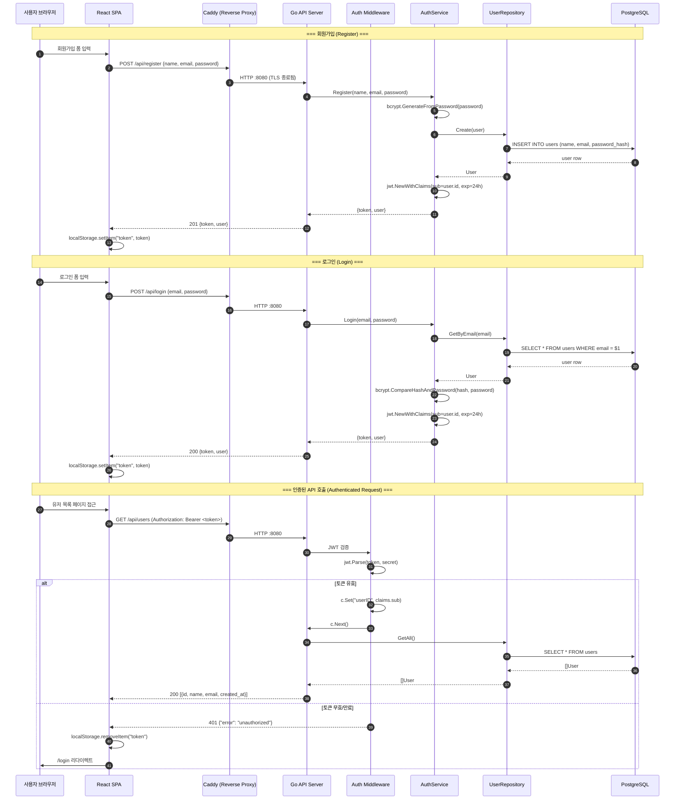

# JWT 인증 시퀀스 다이어그램

<!-- 
  역할: JWT 기반 인증 플로우(회원가입/로그인/인증된 요청)를 시간 순서로 시각화하는 시퀀스 다이어그램 wrapper
  시스템 내 위치: docs/architecture/ — C4 Component(L3) 레벨의 동적 뷰(행위 관점)
  관련 파일: sequence-auth.mmd (순수 Mermaid 소스), component-backend.md (정적 구조), component-frontend.md (정적 구조)
  설계 의도: 정적 구조(C4 Component)만으로는 파악하기 어려운 "시간 흐름"과 "데이터 변환 과정"을
            시퀀스 다이어그램으로 보여주어, JWT 토큰의 생명주기를 완전히 이해할 수 있게 한다.
-->

## 이 다이어그램이 설명하는 것

회원가입 → 로그인 → 인증된 API 호출의 3가지 시나리오에서 JWT 토큰이 어떻게 발급되고 검증되는지 시간 순서대로 보여준다.

## 코드 매핑

<!-- 시퀀스 다이어그램의 각 참여자(participant)가 실제 코드의 어디에 대응하는지를 정리한다. -->

| 다이어그램 노드 | 실제 파일 경로 | 주요 함수/컴포넌트 |
|---------------|-------------|----------------|
| React SPA | `frontend/src/context/AuthContext.tsx` | login(), register() |
| Caddy | (AWS 배포 시) EC2 User Data 내 Caddyfile | reverse_proxy :8080 |
| Go API Server | `backend/cmd/server/main.go` | router.POST/GET |
| Auth Middleware | `backend/internal/middleware/auth_middleware.go` | AuthMiddleware() |
| AuthService | `backend/internal/service/auth_service.go` | Login(), Register() |
| UserRepository | `backend/internal/repository/user_repository.go` | Create(), GetByEmail() |
| PostgreSQL | `backend/migrations/001_create_users.sql` | users 테이블 |

## 다이어그램

<!-- sequence-auth.mmd 파일의 내용을 그대로 삽입한다. -->

## 왜 이 구조인가 (설계 의도)

<!-- JWT stateless 인증, bcrypt, Caddy TLS 종료의 "왜"를 설명한다. -->

- JWT(stateless)를 선택한 이유: 세션 저장소 불필요, EC2 단일 인스턴스에서도 scale-out 가능한 구조
- bcrypt로 비밀번호 해싱: 단방향이므로 DB 유출 시에도 원본 비밀번호 복원 불가
- 로컬에서는 Caddy 없이 직접 :8080 접근, AWS에서는 Caddy가 TLS 종료 후 reverse proxy

## 관련 학습 포인트

<!-- JWT 인증 플로우에서 학습할 수 있는 핵심 개념들. -->

- **JWT의 구조**: header.payload.signature -- 서버가 서명만 검증하면 되므로 DB 조회 불필요
- **Stateless 인증의 단점**: 토큰 즉시 무효화 불가 (향후 SESSIONS 테이블로 refresh token 도입 시 해결)
- **bcrypt의 cost factor**: 해싱에 의도적으로 시간을 걸어 brute force 공격 비용을 높임
