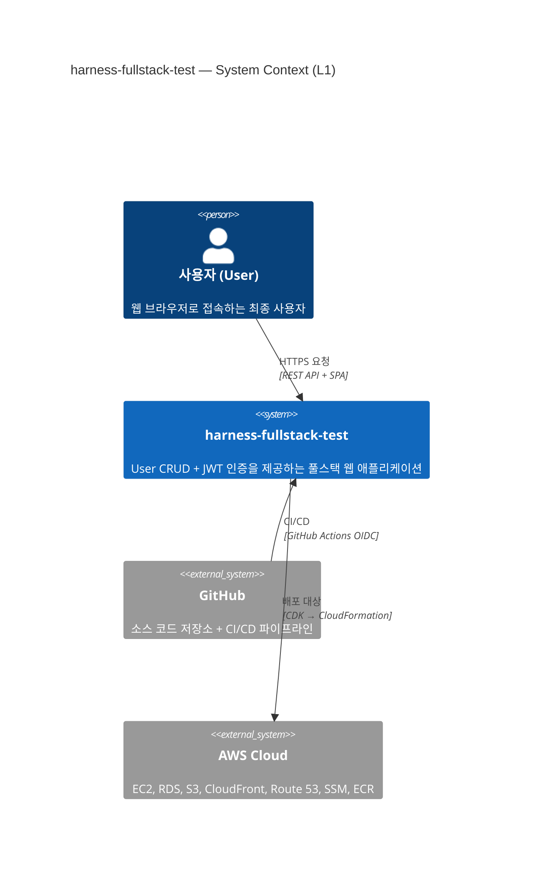
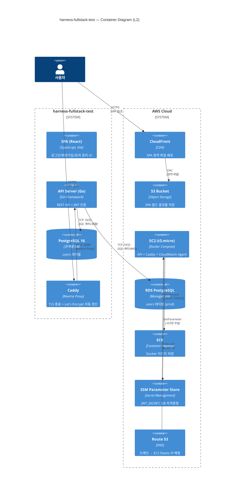
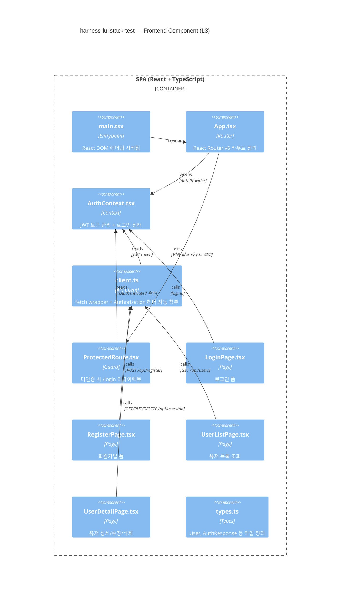
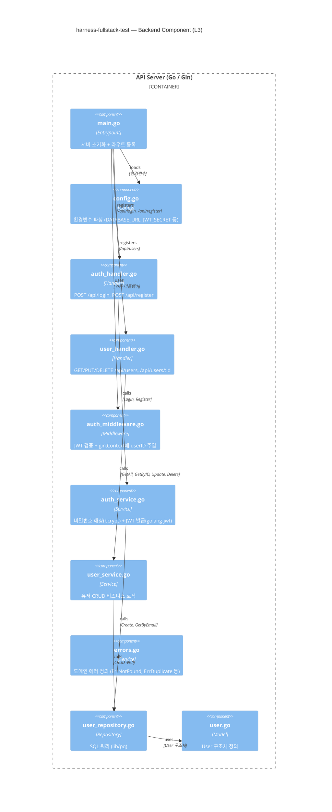
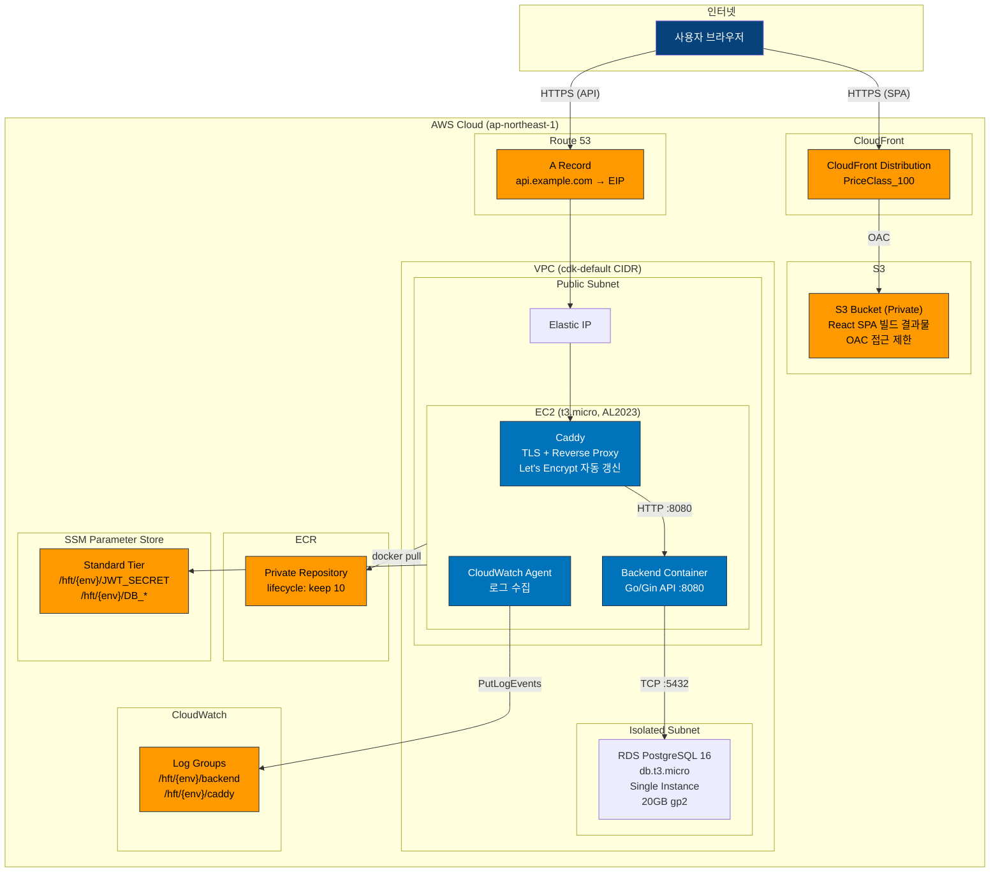
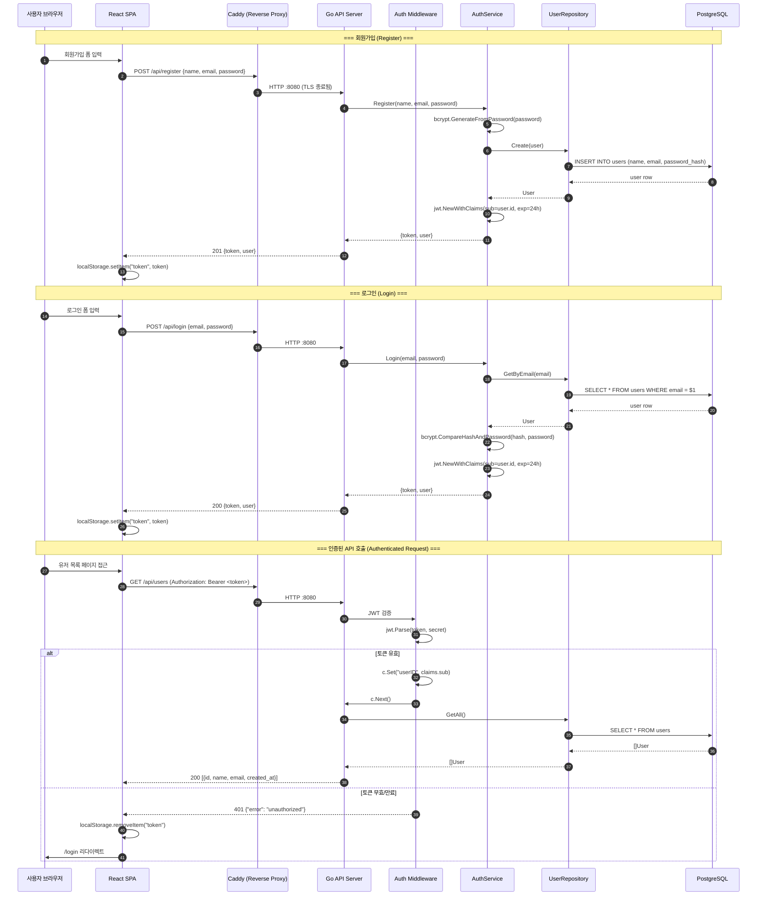
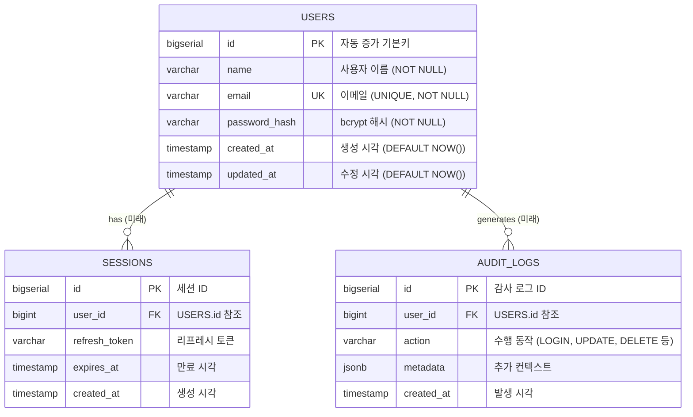

# Infra Architect Harness Extension — Plan B (Reference Implementation)

> **For agentic workers:** REQUIRED SUB-SKILL: Use superpowers:subagent-driven-development (recommended) or superpowers:executing-plans to implement this plan task-by-task. Steps use checkbox (`- [ ]`) syntax for tracking.

**Goal:** 현재 프로젝트(harness-fullstack-test)에 AWS Free Tier reference 구현을 추가한다 — 아키텍처 다이어그램 7개, ADR 11개, decisions.json, CDK TypeScript 프로젝트 5 Stack, 배포 워크플로우, CI diagrams-lint, conventions 갱신.

**Architecture:** fullstack-orchestrator Phase 0-0 → 0-5 → 2 → 3 → 4 → 5 흐름으로 에이전트 팀 병렬 실행. solution-architect가 다이어그램+ADR+decisions.json 생성 → project-architect가 conventions 갱신 → cloud-infra-dev가 CDK 프로젝트 생성 + backend-dev가 Dockerfile 수정 + infra-dev가 CI 추가 → QA 검증 → PR 생성.

**Tech Stack:** AWS CDK (TypeScript) / PostgreSQL 16 / EC2 + Docker Compose / S3 + CloudFront / RDS / SSM Parameter Store / Route 53 / Let's Encrypt (Caddy) / GitHub Actions OIDC

**Design Spec:** `feat/infra-architect-spec` 브랜치의 `docs/superpowers/specs/2026-04-11-infra-architect-harness-extension-design.md`

**DB Engine 결정:** PostgreSQL 16 (기존 프로젝트 docker-compose.yml, CLAUDE.md에서 확정. 설계 스펙의 "TBD"는 이 계획에서 PostgreSQL로 해소)

**Predecessor:** Plan A (PR #18) 머지 완료 — 에이전트/스킬 구조 이미 존재

---

## 에이전트 배정 및 의존성

```
Phase 0-0: solution-architect → Task 1~5 (decisions.json + 다이어그램 + ADR)
Phase 0-5: project-architect  → Task 6 (conventions 갱신)
Phase 2-3: parallel
  ├─ backend-dev              → Task 7 (Dockerfile 수정)
  ├─ infra-dev                → Task 17 (CI diagrams-lint)
  └─ cloud-infra-dev          → Task 8~16 (CDK 전체, backend-dev 완료 후 시작)
Phase 4-4: orchestrator       → Task 18 (README 갱신)
Phase 4-5: code-reviewer      → Codex 리뷰
Phase 5:   orchestrator       → PR 생성
```

---

## Task 1: decisions.json 작성

**Agent:** solution-architect
**Files:**
- Create: `_workspace/architecture/decisions.json`

- [ ] **Step 1: _workspace/architecture/ 디렉토리 생성**

```bash
mkdir -p _workspace/architecture
```

- [ ] **Step 2: decisions.json 작성**

```json
{
  "schema_version": "1.0",
  "created_at": "2026-04-12T00:00:00Z",
  "updated_at": "2026-04-12T00:00:00Z",

  "project": {
    "name": "harness-fullstack-test",
    "owner": "dev-sl0xw",
    "stack": {
      "backend": "go/gin",
      "frontend": "react/vite/ts",
      "database": "postgresql"
    }
  },

  "non_functional": {
    "allowed_regions": ["us-east-1", "ap-northeast-1", "ap-northeast-3"],
    "region_roles": {
      "primary_workload": "ap-northeast-1",
      "backup_vault": null,
      "global_services": "us-east-1"
    },
    "traffic_scale": "mvp",
    "cost_target": "aws-free-tier",
    "availability_target_current": "best-effort",
    "availability_target_future": "99.9",
    "compliance": []
  },

  "cloud": {
    "provider": "aws",
    "accounts": { "dev": "TBD", "stg": "TBD", "prod": "TBD" }
  },

  "iac": {
    "tool": "cdk",
    "language": "typescript",
    "directory": "infra/aws-cdk"
  },

  "compute": {
    "backend": {
      "type": "ec2-docker-compose",
      "image_registry": "ecr",
      "per_environment": {
        "dev":  {"instance_type": "t3.micro", "count": 1, "ami": "al2023", "user_data_version": 1},
        "stg":  {"instance_type": "t3.micro", "count": 1, "ami": "al2023", "user_data_version": 1},
        "prod": {"instance_type": "t3.micro", "count": 1, "ami": "al2023", "user_data_version": 1}
      },
      "runtime": {
        "docker_version": "24.x",
        "docker_compose_plugin": "v2",
        "reverse_proxy": "caddy",
        "ssm_agent": true
      }
    },
    "frontend": {
      "type": "s3-cloudfront"
    }
  },

  "data": {
    "primary": {
      "engine": "postgresql",
      "version": "16",
      "per_environment": {
        "dev":  {"deploy_type": "single-instance", "instance_class": "db.t3.micro", "multi_az": false, "reader_replicas": 0, "storage_gb": 20, "backup_retention_days": 1},
        "stg":  {"deploy_type": "single-instance", "instance_class": "db.t3.micro", "multi_az": false, "reader_replicas": 0, "storage_gb": 20, "backup_retention_days": 7},
        "prod": {"deploy_type": "single-instance", "instance_class": "db.t3.micro", "multi_az": false, "reader_replicas": 0, "storage_gb": 20, "backup_retention_days": 7}
      },
      "endpoints": {
        "writer_env_var": "DATABASE_URL",
        "reader_env_var": null
      }
    }
  },

  "networking": {
    "vpc": {
      "cidr_strategy": "cdk-default",
      "public_subnets": 1,
      "private_subnets": 0,
      "isolated_subnets": 1,
      "nat_gateway": { "dev": "none", "stg": "none", "prod": "none" },
      "load_balancer": false
    }
  },

  "secrets": {
    "store": "ssm-parameter-store",
    "tier": "standard",
    "per_environment": {
      "dev":  { "rotation": false },
      "stg":  { "rotation": false },
      "prod": { "rotation": false }
    }
  },

  "observability": {
    "per_environment": {
      "dev":  { "logs": "cloudwatch-logs", "metrics": "cloudwatch-agent", "traces": null, "dashboards": false, "alarms": false },
      "stg":  { "logs": "cloudwatch-logs", "metrics": "cloudwatch-agent", "traces": null, "dashboards": false, "alarms": false },
      "prod": { "logs": "cloudwatch-logs", "metrics": "cloudwatch-agent", "traces": null, "dashboards": false, "alarms": false }
    }
  },

  "backup": {
    "service": "rds-automated-backup",
    "per_environment": {
      "dev":  { "enabled": false, "retention_days": 1 },
      "stg":  { "enabled": true,  "retention_days": 7 },
      "prod": { "enabled": true,  "retention_days": 7 }
    }
  },

  "cdn": {
    "service": "cloudfront",
    "per_environment": {
      "dev":  { "cache_policy": "no-cache", "waf": false, "price_class": "PriceClass_100" },
      "stg":  { "cache_policy": "default",  "waf": false, "price_class": "PriceClass_100" },
      "prod": { "cache_policy": "default",  "waf": false, "price_class": "PriceClass_100" }
    }
  },

  "tls": {
    "service": "lets-encrypt-on-ec2",
    "per_environment": {
      "dev":  { "cert": null },
      "stg":  { "cert": "lets-encrypt", "renewal": "auto-caddy" },
      "prod": { "cert": "lets-encrypt", "renewal": "auto-caddy" }
    }
  },

  "dns": {
    "managed_service": "route53",
    "hosted_zone_cost_usd_per_month": 0.50,
    "hosted_zone": { "dev": null, "stg": "TBD", "prod": "TBD" }
  },

  "ecr": {
    "lifecycle_policy": { "keep_last": 10, "untagged_expire_days": 7 }
  },

  "deployment": {
    "strategy": {
      "per_environment": {
        "dev":  { "type": "restart", "description": "EC2에서 docker compose pull && up -d (in-place)" },
        "stg":  { "type": "restart", "description": "동일" },
        "prod": { "type": "restart", "description": "brief downtime 허용. Stage 2에서 ASG instance refresh로 전환" }
      }
    }
  },

  "cicd": {
    "ci": "github-actions",
    "cd": {
      "method": "github-actions-oidc",
      "apply_trigger": {
        "dev":  "manual-workflow-dispatch",
        "stg":  "manual-approval",
        "prod": "manual-approval-with-review"
      }
    }
  },

  "cloud_infra_dev": {
    "activate": true,
    "skill_refs": ["aws-cdk"],
    "output_directory": "infra/aws-cdk"
  },

  "architecture_docs": {
    "directory": "docs/architecture",
    "diagrams": [
      "context.mmd", "container.mmd", "component-frontend.mmd",
      "component-backend.mmd", "deployment-aws.mmd",
      "sequence-auth.mmd", "er-schema.mmd"
    ],
    "wrappers_format": {
      "required_sections": ["설명", "코드 매핑", "다이어그램", "설계 의도", "학습 포인트"]
    },
    "adrs": [
      "0001-cloud-aws.md", "0002-iac-cdk.md", "0003-compute-ec2-docker-compose.md",
      "0004-data-rds-progressive.md", "0005-secrets-ssm-parameter-store.md",
      "0006-db-evolution-path.md", "0007-region-strategy.md",
      "0008-db-schema-migration-strategy.md", "0009-deployment-strategy.md",
      "0010-schema-migration-compatibility.md", "0011-single-ec2-availability.md"
    ]
  },

  "conventions_updates_requested": [
    "docs/conventions/secrets.md: SSM Parameter Store 주입 방식 + SecureString 필수 전환 매뉴얼",
    "docs/conventions/12-factor.md: EC2 User Data → docker compose env_file 주입 흐름",
    "docs/conventions/dependencies.md: CDK 버전 핀 정책 (aws-cdk-lib ^2.150.0)",
    "docs/conventions/principles.md: 리전 화이트리스트 가드 패턴 + DB engine 무관 스키마"
  ],

  "cost_estimate": {
    "free_tier_monthly_usd": 0.50,
    "post_free_tier_monthly_usd": 25,
    "free_tier_duration_months": 12,
    "line_items": {
      "ec2_t3_micro": "free 12mo → ~8",
      "rds_t3_micro": "free 12mo → ~15",
      "route53_hosted_zone": "0.50",
      "s3_cloudfront": "within free tier",
      "ssm_parameter_store": "0 (standard tier)",
      "cloudwatch_logs": "within free tier (<5GB)",
      "ecr_private": "within free tier (<500MB)"
    }
  }
}
```

- [ ] **Step 3: JSON 유효성 검증**

```bash
cat _workspace/architecture/decisions.json | python3 -m json.tool > /dev/null && echo "VALID" || echo "INVALID"
```

Expected: `VALID`

- [ ] **Step 4: Commit**

```bash
git add _workspace/architecture/decisions.json
git commit -m "feat(architecture): add decisions.json — single source of truth for AWS deployment"
```

---

## Task 2: Mermaid 다이어그램 7개 (.mmd 파일)

**Agent:** solution-architect (architecture-diagrams 스킬 사용)
**Files:**
- Create: `docs/architecture/context.mmd`
- Create: `docs/architecture/container.mmd`
- Create: `docs/architecture/component-frontend.mmd`
- Create: `docs/architecture/component-backend.mmd`
- Create: `docs/architecture/deployment-aws.mmd`
- Create: `docs/architecture/sequence-auth.mmd`
- Create: `docs/architecture/er-schema.mmd`

- [ ] **Step 1: 디렉토리 생성**

```bash
mkdir -p docs/architecture/adr
```

- [ ] **Step 2: context.mmd (C4 Context — L1)**



- [ ] **Step 3: container.mmd (C4 Container — L2)**



- [ ] **Step 4: component-frontend.mmd (C4 Component — L3 Frontend)**



- [ ] **Step 5: component-backend.mmd (C4 Component — L3 Backend)**



- [ ] **Step 6: deployment-aws.mmd (Deployment Diagram)**



- [ ] **Step 7: sequence-auth.mmd (JWT 인증 시퀀스)**



- [ ] **Step 8: er-schema.mmd (ER Diagram)**



- [ ] **Step 9: 7개 .mmd 파일 모두 작성 후 mermaid 문법 검증**

```bash
for mmd in docs/architecture/*.mmd; do
  echo "Validating: $mmd"
  npx -y @mermaid-js/mermaid-cli -i "$mmd" -o /tmp/$(basename "$mmd" .mmd).svg 2>&1 || echo "WARN: $mmd render issue (may need GitHub native render)"
done
```

- [ ] **Step 10: Commit**

```bash
git add docs/architecture/*.mmd
git commit -m "feat(architecture): add 7 Mermaid diagrams — C4 L1~L3 + deployment + sequence + ER"
```

---

## Task 3: Markdown Wrapper 7개 (.md 파일)

**Agent:** solution-architect (architecture-diagrams 스킬 사용)
**Files:**
- Create: `docs/architecture/context.md`
- Create: `docs/architecture/container.md`
- Create: `docs/architecture/component-frontend.md`
- Create: `docs/architecture/component-backend.md`
- Create: `docs/architecture/deployment-aws.md`
- Create: `docs/architecture/sequence-auth.md`
- Create: `docs/architecture/er-schema.md`

모든 wrapper는 다음 5 섹션을 포함해야 한다:
1. "이 다이어그램이 설명하는 것" (1~2문장)
2. "코드 매핑" (다이어그램 노드 ↔ 실제 파일 경로 표)
3. mermaid 다이어그램 코드 블록 (`.mmd` 파일 내용 embed)
4. "왜 이 구조인가 (설계 의도)"
5. "관련 학습 포인트"

- [ ] **Step 1: context.md**

```markdown
# System Context Diagram (C4 Level 1)

## 이 다이어그램이 설명하는 것
harness-fullstack-test 시스템의 최상위 경계를 보여준다. 사용자, 외부 시스템(GitHub, AWS)과의 관계를 한 눈에 파악할 수 있다.

## 코드 매핑
| 다이어그램 노드 | 실제 파일 경로 | 주요 함수/컴포넌트 |
|---------------|-------------|----------------|
| harness-fullstack-test | 프로젝트 전체 | — |
| GitHub | `.github/workflows/ci.yml` | CI 파이프라인 |
| AWS Cloud | `infra/aws-cdk/` | CDK Stack 정의 |

\```mermaid
(context.mmd 내용 삽입)
\```

## 왜 이 구조인가 (설계 의도)
- C4 Context는 "이 시스템이 무엇이고 누구와 상호작용하는가"를 비개발자에게도 설명할 수 있는 최상위 뷰이다
- 외부 의존성(AWS, GitHub)을 명시하여 시스템 경계를 분명히 한다
- 학습자가 전체 그림을 먼저 파악한 후 하위 레벨로 내려가도록 유도한다

## 관련 학습 포인트
- C4 Model: Context → Container → Component → Code 의 4단계 zoom-in 접근법
- System Boundary: 우리가 제어하는 범위 vs 외부에 의존하는 범위의 구분
- 이 다이어그램에서 AWS는 "외부 시스템"이지만, deployment 다이어그램에서는 내부 구성 요소로 확장된다
```

- [ ] **Step 2: container.md**

```markdown
# Container Diagram (C4 Level 2)

## 이 다이어그램이 설명하는 것
시스템 내부의 실행 단위(Container)를 보여준다. 로컬(Docker Compose)과 AWS 환경에서 어떤 컨테이너/서비스가 어떤 역할을 하는지, 그리고 서로 어떻게 통신하는지를 나타낸다.

## 코드 매핑
| 다이어그램 노드 | 실제 파일 경로 | 주요 함수/컴포넌트 |
|---------------|-------------|----------------|
| SPA (React) | `frontend/src/` | App.tsx, pages/ |
| API Server (Go) | `backend/cmd/server/main.go` | main(), router setup |
| PostgreSQL | `docker-compose.yml` → db service | — |
| Caddy | `infra/aws-cdk/lib/ec2-app-stack.ts` | User Data 내 Caddy 설정 |
| CloudFront | `infra/aws-cdk/lib/frontend-stack.ts` | FrontendStack |
| S3 Bucket | `infra/aws-cdk/lib/frontend-stack.ts` | S3 bucket 생성 |
| EC2 | `infra/aws-cdk/lib/ec2-app-stack.ts` | Ec2AppStack |
| RDS | `infra/aws-cdk/lib/database-stack.ts` | DatabaseStack |
| ECR | `infra/aws-cdk/lib/ec2-app-stack.ts` | ECR repository |
| SSM | `infra/aws-cdk/lib/ec2-app-stack.ts` | SSM parameter |
| Route 53 | `infra/aws-cdk/lib/ec2-app-stack.ts` | A Record |

\```mermaid
(container.mmd 내용 삽입)
\```

## 왜 이 구조인가 (설계 의도)
- 로컬(Docker Compose)과 클라우드(AWS)의 1:1 매핑을 명시하여 "로컬에서 되면 클라우드에서도 된다"는 확신을 준다
- Caddy를 TLS reverse proxy로 선택한 이유: Let's Encrypt 자동 갱신이 기본 내장, 설정이 간결, ALB 비용 절감
- ECR + SSM을 통한 이미지·시크릿 관리로 Docker Hub 의존성과 평문 시크릿을 제거한다

## 관련 학습 포인트
- C4 Container: "독립적으로 배포 가능한 단위"의 의미 — SPA와 API는 별도 빌드·배포 단위
- 로컬 vs 클라우드 환경에서 같은 docker-compose.yml을 재사용하는 패턴
- OAC(Origin Access Control): S3 bucket을 public으로 열지 않고 CloudFront를 통해서만 접근 허용
```

- [ ] **Step 3: component-frontend.md**

```markdown
# Frontend Component Diagram (C4 Level 3)

## 이 다이어그램이 설명하는 것
React SPA 내부의 컴포넌트 구조를 보여준다. 라우팅, 인증 상태 관리, API 호출, 페이지 간의 의존 관계를 시각화한다.

## 코드 매핑
| 다이어그램 노드 | 실제 파일 경로 | 주요 함수/컴포넌트 |
|---------------|-------------|----------------|
| main.tsx | `frontend/src/main.tsx` | ReactDOM.createRoot() |
| App.tsx | `frontend/src/App.tsx` | Routes 정의 |
| AuthContext.tsx | `frontend/src/context/AuthContext.tsx` | AuthProvider, useAuth() |
| client.ts | `frontend/src/api/client.ts` | apiFetch() |
| ProtectedRoute.tsx | `frontend/src/components/ProtectedRoute.tsx` | ProtectedRoute |
| LoginPage.tsx | `frontend/src/pages/LoginPage.tsx` | LoginPage |
| RegisterPage.tsx | `frontend/src/pages/RegisterPage.tsx` | RegisterPage |
| UserListPage.tsx | `frontend/src/pages/UserListPage.tsx` | UserListPage |
| UserDetailPage.tsx | `frontend/src/pages/UserDetailPage.tsx` | UserDetailPage |
| types.ts | `frontend/src/types.ts` | User, AuthResponse |

\```mermaid
(component-frontend.mmd 내용 삽입)
\```

## 왜 이 구조인가 (설계 의도)
- AuthContext가 최상위에서 인증 상태를 관리하여 모든 하위 컴포넌트가 동일한 토큰에 접근 가능
- ProtectedRoute로 인증 분기를 라우트 레벨에서 처리하여 각 페이지가 인증 로직을 반복하지 않음 (DRY)
- API client가 AuthContext에서 토큰을 읽어 자동으로 Authorization 헤더를 붙이므로, 각 페이지는 인증 세부사항을 몰라도 됨

## 관련 학습 포인트
- React Context API: props drilling 없이 전역 상태를 공유하는 패턴
- Protected Route 패턴: SPA에서 미인증 사용자의 접근을 가드하는 표준 방법
- 관심사 분리: pages/(UI) ↔ context/(상태) ↔ api/(통신) ↔ types/(타입)
```

- [ ] **Step 4: component-backend.md**

```markdown
# Backend Component Diagram (C4 Level 3)

## 이 다이어그램이 설명하는 것
Go(Gin) 백엔드의 레이어 구조를 보여준다. Handler → Service → Repository 패턴을 따르며, Middleware가 인증을 횡단 관심사로 처리한다.

## 코드 매핑
| 다이어그램 노드 | 실제 파일 경로 | 주요 함수/컴포넌트 |
|---------------|-------------|----------------|
| main.go | `backend/cmd/server/main.go` | main() |
| config.go | `backend/internal/config/config.go` | Load() |
| auth_handler.go | `backend/internal/handler/auth_handler.go` | Login(), Register() |
| user_handler.go | `backend/internal/handler/user_handler.go` | GetAll(), GetByID(), Update(), Delete() |
| auth_middleware.go | `backend/internal/middleware/auth_middleware.go` | AuthMiddleware() |
| auth_service.go | `backend/internal/service/auth_service.go` | Login(), Register() |
| user_service.go | `backend/internal/service/user_service.go` | GetAll(), GetByID(), Update(), Delete() |
| errors.go | `backend/internal/service/errors.go` | ErrNotFound, ErrDuplicate |
| user_repository.go | `backend/internal/repository/user_repository.go` | Create(), GetByEmail(), GetAll() 등 |
| user.go | `backend/internal/model/user.go` | User struct |

\```mermaid
(component-backend.mmd 내용 삽입)
\```

## 왜 이 구조인가 (설계 의도)
- Handler→Service→Repository 3층 구조: 각 레이어가 하나의 책임만 가지며(SRP), 테스트 시 하위 레이어를 교체 가능
- Middleware로 JWT 검증을 분리하여 각 Handler가 인증 로직을 반복하지 않음
- Service 레이어에 도메인 에러를 정의하여 Handler가 HTTP 상태 코드로 변환하는 책임만 가짐

## 관련 학습 포인트
- Layered Architecture: Presentation(Handler) → Business(Service) → Data(Repository)
- Gin의 middleware chain: 요청 → CORS → Auth → Handler → 응답
- bcrypt의 단방향 해싱: password_hash에서 원본 비밀번호를 복원할 수 없음
```

- [ ] **Step 5: deployment-aws.md**

```markdown
# AWS Deployment Diagram

## 이 다이어그램이 설명하는 것
AWS Free Tier 범위에서의 배포 토폴로지를 보여준다. 단일 EC2에 Docker Compose로 백엔드를 실행하고, S3+CloudFront로 프론트엔드를 배포한다.

## 코드 매핑
| 다이어그램 노드 | 실제 파일 경로 | 주요 함수/컴포넌트 |
|---------------|-------------|----------------|
| VPC | `infra/aws-cdk/lib/network-stack.ts` | NetworkStack |
| EC2 + Docker Compose | `infra/aws-cdk/lib/ec2-app-stack.ts` | Ec2AppStack |
| RDS PostgreSQL | `infra/aws-cdk/lib/database-stack.ts` | DatabaseStack |
| CloudFront + S3 | `infra/aws-cdk/lib/frontend-stack.ts` | FrontendStack |
| CloudWatch Logs | `infra/aws-cdk/lib/observability-stack.ts` | ObservabilityStack |
| Route 53 | `infra/aws-cdk/lib/ec2-app-stack.ts` | Route53 A Record |
| Elastic IP | `infra/aws-cdk/lib/ec2-app-stack.ts` | CfnEIP |
| ECR | `infra/aws-cdk/lib/ec2-app-stack.ts` | Repository |
| SSM | `infra/aws-cdk/lib/ec2-app-stack.ts` | StringParameter |

\```mermaid
(deployment-aws.mmd 내용 삽입)
\```

## 왜 이 구조인가 (설계 의도)
- **Free Tier 최적화**: ALB($16/월) 대신 Caddy(무료), NAT Gateway($32/월) 대신 public subnet, Secrets Manager($0.40/secret/월) 대신 SSM Parameter Store(무료)
- **단일 EC2**: 학습용이므로 HA 불필요. 배포 시 brief downtime 허용 (Stage 2에서 ASG로 전환 경로 있음)
- **Isolated Subnet에 RDS**: DB는 퍼블릭 인터넷에서 직접 접근 불가. EC2에서만 접근 가능

## 관련 학습 포인트
- VPC 서브넷 설계: public(인터넷 접근 가능) vs isolated(인터넷 차단) — private은 NAT 필요하므로 Free Tier에서 제외
- Let's Encrypt + Caddy: 무료 TLS 인증서 자동 발급·갱신. ALB의 ACM 대안
- EC2 User Data: 인스턴스 최초 부팅 시 자동 실행되는 초기화 스크립트
- SSM Session Manager: SSH 없이 EC2에 접속하는 AWS 기본 기능 (22번 포트 불필요)
```

- [ ] **Step 6: sequence-auth.md**

```markdown
# JWT 인증 시퀀스 다이어그램

## 이 다이어그램이 설명하는 것
회원가입 → 로그인 → 인증된 API 호출의 3가지 시나리오에서 JWT 토큰이 어떻게 발급되고 검증되는지 시간 순서대로 보여준다.

## 코드 매핑
| 다이어그램 노드 | 실제 파일 경로 | 주요 함수/컴포넌트 |
|---------------|-------------|----------------|
| React SPA | `frontend/src/context/AuthContext.tsx` | login(), register() |
| Caddy | (AWS 배포 시) EC2 User Data 내 Caddyfile | reverse_proxy :8080 |
| Go API Server | `backend/cmd/server/main.go` | router.POST/GET |
| Auth Middleware | `backend/internal/middleware/auth_middleware.go` | AuthMiddleware() |
| AuthService | `backend/internal/service/auth_service.go` | Login(), Register() |
| UserRepository | `backend/internal/repository/user_repository.go` | Create(), GetByEmail() |
| PostgreSQL | `backend/migrations/001_create_users.sql` | users 테이블 |

\```mermaid
(sequence-auth.mmd 내용 삽입)
\```

## 왜 이 구조인가 (설계 의도)
- JWT(stateless)를 선택한 이유: 세션 저장소 불필요, EC2 단일 인스턴스에서도 scale-out 가능한 구조
- bcrypt로 비밀번호 해싱: 단방향이므로 DB 유출 시에도 원본 비밀번호 복원 불가
- 로컬에서는 Caddy 없이 직접 :8080 접근, AWS에서는 Caddy가 TLS 종료 후 reverse proxy

## 관련 학습 포인트
- JWT의 구조: header.payload.signature — 서버가 서명만 검증하면 되므로 DB 조회 불필요
- Stateless 인증의 단점: 토큰 즉시 무효화 불가 (향후 SESSIONS 테이블로 refresh token 도입 시 해결)
- bcrypt의 cost factor: 해싱에 의도적으로 시간을 걸어 brute force 공격 비용을 높임
```

- [ ] **Step 7: er-schema.md**

```markdown
# ER (Entity-Relationship) Diagram

## 이 다이어그램이 설명하는 것
현재 데이터베이스 스키마(users 테이블)와 향후 확장 지점(sessions, audit_logs)을 보여준다.

## 코드 매핑
| 다이어그램 노드 | 실제 파일 경로 | 주요 함수/컴포넌트 |
|---------------|-------------|----------------|
| USERS | `backend/migrations/001_create_users.sql` | CREATE TABLE users |
| USERS (rename) | `backend/migrations/002_rename_password_to_hash.sql` | ALTER TABLE |
| User struct | `backend/internal/model/user.go` | type User struct |
| SESSIONS (미래) | — | refresh token 도입 시 |
| AUDIT_LOGS (미래) | — | 감사 로깅 도입 시 |

\```mermaid
(er-schema.mmd 내용 삽입)
\```

## 왜 이 구조인가 (설계 의도)
- MVP이므로 users 테이블 하나만 구현. 불필요한 테이블을 미리 만들지 않음 (YAGNI)
- password_hash로 컬럼명을 변경하여 "이것은 해시값이지 원본 비밀번호가 아님"을 명시 (migration 002)
- 향후 확장 지점을 다이어그램에만 표시하여, 실제 코드 없이도 진화 방향을 파악할 수 있게 함

## 관련 학습 포인트
- 데이터베이스 마이그레이션: 스키마 변경을 코드처럼 버전 관리하는 방법
- Backward-compatible migration: 기존 데이터를 보존하면서 스키마를 변경하는 원칙
- ER Diagram의 관계 표기법: `||--o{` = "하나에 대해 0개 이상" (one-to-many)
```

- [ ] **Step 8: Commit**

```bash
git add docs/architecture/*.md
git commit -m "feat(architecture): add 7 Markdown wrapper files with code mapping tables"
```

---

## Task 4: ADR (Architecture Decision Records) 11개

**Agent:** solution-architect
**Files:**
- Create: `docs/architecture/adr/0001-cloud-aws.md` ~ `docs/architecture/adr/0011-single-ec2-availability.md`

모든 ADR은 동일한 구조를 따른다:

```markdown
# ADR-NNNN: {제목}

**Status:** Accepted
**Date:** 2026-04-12
**Deciders:** 프로젝트 팀

## Context
{결정이 필요했던 배경과 제약 조건}

## Decision
{내린 결정}

## Consequences
### Positive
- ...
### Negative
- ...

## Alternatives Considered
| 대안 | 장점 | 단점 | 기각 사유 |
|------|------|------|----------|

## Evolution Path
{향후 변경이 필요할 때의 전환 경로}
```

- [ ] **Step 1: ADR 0001 — Cloud Provider: AWS**

```markdown
# ADR-0001: Cloud Provider — AWS

**Status:** Accepted
**Date:** 2026-04-12
**Deciders:** 프로젝트 팀

## Context
학습용 풀스택 프로젝트에 클라우드 배포를 추가한다. 비용을 최소화(Free Tier 활용)하면서 실제 프로덕션 패턴을 학습할 수 있는 클라우드 플랫폼이 필요하다.

## Decision
**AWS**를 클라우드 플랫폼으로 선택한다.

## Consequences
### Positive
- 12개월 Free Tier로 EC2 t3.micro + RDS db.t3.micro 무료 사용
- 시장 점유율 1위로 학습 투자 대비 활용 범위가 넓음
- CDK(TypeScript)로 IaC를 작성하여 프론트엔드 개발자도 접근 가능
- SSM Parameter Store Standard Tier 무료 (Secrets Manager $0.40/secret/월 절감)

### Negative
- GCP의 Always Free Tier(f1-micro)와 달리 12개월 후 과금 시작 (~$25/월)
- AWS 콘솔 UI가 복잡하여 학습 진입 장벽이 높음

## Alternatives Considered
| 대안 | 장점 | 단점 | 기각 사유 |
|------|------|------|----------|
| GCP | Always Free f1-micro, Firebase 연동 | Free Tier 스펙이 낮음 (0.6GB RAM), CDK 미지원 | CDK 사용 불가 |
| Azure | 12개월 Free, VS Code 연동 | Free Tier VM이 B1s(1vCPU/1GB)로 제한적 | 팀 경험 부족 |
| DigitalOcean/Fly.io | 단순한 배포 경험 | IaC 생태계 미약, 학습 전이 가치 낮음 | 프로덕션 패턴 학습 목적 불부합 |

## Evolution Path
- GCP/Azure 지원 시: `cloud-infra-build/references/gcp-*.md`, `aws-terraform.md` 스텁 활성화
- Multi-cloud 시: Terraform으로 전환 검토 (ADR 별도 작성)
```

- [ ] **Step 2: ADR 0002 — IaC Tool: CDK (TypeScript)**

```markdown
# ADR-0002: IaC Tool — CDK (TypeScript)

**Status:** Accepted
**Date:** 2026-04-12
**Deciders:** 프로젝트 팀

## Context
AWS 인프라를 코드로 정의할 IaC 도구가 필요하다. 프론트엔드(TypeScript)와 백엔드(Go) 스택에서 팀이 이미 TypeScript에 익숙하다.

## Decision
**AWS CDK (TypeScript)**를 IaC 도구로 선택한다.

## Consequences
### Positive
- TypeScript의 타입 안전성으로 CloudFormation YAML 실수 방지
- L2 construct로 보일러플레이트 감소 (VPC 생성이 3줄)
- `cdk synth`로 배포 없이 CloudFormation 템플릿 검증 가능
- Jest snapshot test로 인프라 변경을 코드 리뷰에서 감지

### Negative
- CloudFormation에 의존하므로 drift 감지·state 관리가 Terraform보다 약함
- CDK 버전 업데이트가 잦아 breaking change 위험

## Alternatives Considered
| 대안 | 장점 | 단점 | 기각 사유 |
|------|------|------|----------|
| Terraform | Multi-cloud, 성숙한 생태계 | HCL 별도 학습 필요, 프론트엔드 개발자 접근성 낮음 | TypeScript 우선 |
| Pulumi | TypeScript 지원, Multi-cloud | 커뮤니티 규모 작음, state 관리 별도 | CDK 대비 이점 부족 |
| CloudFormation (YAML) | AWS native | 장황한 YAML, 타입 안전성 없음 | 생산성 낮음 |

## Evolution Path
- Terraform 전환 시: `cloud-infra-build/references/aws-terraform.md` 스텁 활성화
- CDK 메이저 업데이트 시: `docs/conventions/dependencies.md`의 CDK 핀 정책 참조
```

- [ ] **Step 3: ADR 0003 — Compute: EC2 + Docker Compose**

```markdown
# ADR-0003: Compute Model — EC2 + Docker Compose

**Status:** Accepted
**Date:** 2026-04-12
**Deciders:** 프로젝트 팀

## Context
백엔드 API를 AWS에서 실행할 컴퓨팅 모델이 필요하다. Free Tier 비용 0원 근사치를 달성하면서 로컬 개발 환경(Docker Compose)과 최대한 동일한 구조를 유지해야 한다.

## Decision
**EC2 (t3.micro) + Docker Compose**로 백엔드를 실행한다.

## Consequences
### Positive
- 로컬 docker-compose.yml과 거의 동일한 구조 → 디버깅 용이
- t3.micro 12개월 무료, Elastic IP 무료 (인스턴스에 attach 시)
- SSM Session Manager로 SSH 없이 접속 가능
- ALB($16/월) 불필요 → Caddy가 TLS reverse proxy 담당

### Negative
- 단일 인스턴스이므로 장애 시 전면 다운 (ADR-0011 참조)
- 수동 OS 패치 필요 (ECS/Fargate는 managed)
- Docker Compose는 오케스트레이션 기능 제한적

## Alternatives Considered
| 대안 | 장점 | 단점 | 기각 사유 |
|------|------|------|----------|
| ECS Fargate | Serverless, 관리 부담 없음 | $18/월 (512MB), Free Tier 없음 | 비용 초과 |
| ECS + EC2 | Free Tier 가능 | ALB 필수($16/월), 복잡한 설정 | ALB 비용 |
| Lambda + API Gateway | 완전 serverless | Go cold start, REST API 매핑 복잡 | 아키텍처 불일치 |

## Evolution Path
- Stage 2: ASG(Auto Scaling Group) + instance refresh로 무중단 배포
- Stage 3: ALB + 2개 ASG Blue/Green 배포
- 장기: ECS Fargate 전환 (비용 허용 시)
```

- [ ] **Step 4: ADR 0004 — Data: RDS PostgreSQL (Progressive)**

```markdown
# ADR-0004: Data Store — RDS PostgreSQL (Progressive)

**Status:** Accepted
**Date:** 2026-04-12
**Deciders:** 프로젝트 팀

## Context
로컬에서 Docker Compose로 PostgreSQL 16을 사용 중이다. AWS 배포 시 동일 엔진의 managed 서비스가 필요하다.

## Decision
**RDS PostgreSQL 16** (db.t3.micro, single-instance)을 사용한다. Free Tier 12개월 적용.

## Consequences
### Positive
- 로컬과 동일 엔진(PostgreSQL 16)으로 호환성 보장
- db.t3.micro 12개월 무료, 20GB gp2 스토리지 무료
- 자동 백업 (retention: prod 7일, dev 1일)
- Isolated subnet에 배치하여 인터넷 접근 차단

### Negative
- Single-instance이므로 AZ 장애 시 DB 다운
- Multi-AZ 전환 시 비용 2배 ($15 → $30/월)

## Alternatives Considered
| 대안 | 장점 | 단점 | 기각 사유 |
|------|------|------|----------|
| Aurora Serverless v2 | Auto-scaling, 고가용성 | 최소 $43/월 (0.5 ACU) | Free Tier 초과 |
| EC2 자체 PostgreSQL | 완전 제어 | 관리 부담 (백업, 패치) | managed 서비스 활용 |
| DynamoDB | Serverless, 25GB 무료 | SQL 불가, 기존 코드 재작성 | 아키텍처 불일치 |

## Evolution Path
- Stage 1 (현재): single-instance, single-AZ
- Stage 2: Multi-AZ 활성화 (가용성 향상)
- Stage 3: Read Replica 추가 (읽기 부하 분산)
- Stage 4: Aurora PostgreSQL 전환 (auto-scaling)
```

- [ ] **Step 5: ADR 0005 — Secrets: SSM Parameter Store**

```markdown
# ADR-0005: Secret Management — SSM Parameter Store

**Status:** Accepted
**Date:** 2026-04-12
**Deciders:** 프로젝트 팀

## Context
JWT_SECRET, DB 자격증명 등의 민감 정보를 안전하게 관리해야 한다. AWS에서 제공하는 비밀 관리 서비스를 선택한다.

## Decision
**SSM Parameter Store (Standard Tier)**를 사용한다. CDK에서 초기 placeholder를 String으로 생성하고, 사용자가 수동으로 SecureString으로 전환한다.

## Consequences
### Positive
- Standard Tier 완전 무료 (10,000개 파라미터까지)
- IAM 정책으로 접근 제어 (`/hft/{env}/*` 경로 기반)
- EC2의 Instance Profile로 자동 인증 (추가 자격증명 불필요)

### Negative
- CDK는 SecureString 직접 생성 불가 → 수동 전환 필요
- Secrets Manager 대비 자동 rotation 기능 없음

## Alternatives Considered
| 대안 | 장점 | 단점 | 기각 사유 |
|------|------|------|----------|
| Secrets Manager | 자동 rotation, CDK 직접 지원 | $0.40/secret/월 | 비용 |
| .env 파일 in EC2 | 단순 | 버전 관리 불가, 접근 제어 약함 | 보안 |
| HashiCorp Vault | 강력한 기능 | 별도 인프라 필요, 복잡 | 오버엔지니어링 |

## Evolution Path
- 현재: String placeholder → 사용자 수동 SecureString 전환
- Stage 2: Secrets Manager로 전환 (자동 rotation 필요 시)
- 파라미터 경로 규칙: `/hft/{env}/{KEY}` (예: `/hft/prod/JWT_SECRET`)
```

- [ ] **Step 6: ADR 0006 — DB Evolution Path**

```markdown
# ADR-0006: Database Evolution Path

**Status:** Accepted
**Date:** 2026-04-12
**Deciders:** 프로젝트 팀

## Context
현재는 single-instance RDS로 충분하지만, 프로젝트가 성장하면 DB 고가용성과 성능이 필요해질 것이다. 진화 경로를 미리 문서화하여 각 단계의 트리거와 비용을 명확히 한다.

## Decision
4단계 진화 경로를 정의하고, 각 단계 전환의 트리거 조건을 명시한다.

## Consequences
### Evolution Stages
| Stage | 구성 | 트리거 | 예상 비용 |
|-------|------|--------|----------|
| 1 (현재) | Single-instance, single-AZ | — | Free → ~$15/월 |
| 2 | Multi-AZ | 가용성 SLA 99.9% 요구 | ~$30/월 |
| 3 | Multi-AZ + Read Replica | 읽기 QPS > 100 | ~$45/월 |
| 4 | Aurora PostgreSQL | 자동 스케일링 필요 | ~$50+/월 |

### Positive
- 각 단계에서 무엇을 변경하는지 명확
- 비용 증가를 사전에 예측 가능

### Negative
- Stage 4 전환 시 endpoint 변경 필요 (CDK stack 수정)
```

- [ ] **Step 7: ADR 0007 — Region Strategy**

```markdown
# ADR-0007: Region Strategy

**Status:** Accepted
**Date:** 2026-04-12
**Deciders:** 프로젝트 팀

## Context
AWS 리전 선택은 지연시간, 비용, 규정 준수에 영향을 미친다. 학습 목적으로 리전 전략을 수립한다.

## Decision
3개 리전 화이트리스트를 설정하고, CDK guards.ts에서 허용 리전 외 배포를 차단한다.

| 리전 | 역할 | MVP 사용 여부 |
|------|------|-------------|
| `ap-northeast-1` (도쿄) | Primary workload | Yes |
| `us-east-1` (버지니아) | Global services (CloudFront ACM 등) | No (MVP에서는 Let's Encrypt 사용) |
| `ap-northeast-3` (오사카) | Backup vault (DR) | No (Stage 2 이후) |

## Consequences
### Positive
- 도쿄 리전으로 한국/일본에서 낮은 지연시간
- 리전 가드로 실수로 다른 리전에 배포하는 사고 방지

### Negative
- us-east-1에 비해 일부 서비스 요금이 약간 높음 (~10%)

## Evolution Path
- Multi-region 배포 시: `ap-northeast-3`를 standby로 활성화
- Global 서비스 시: `us-east-1`에 CloudFront ACM 인증서 발급
```

- [ ] **Step 8: ADR 0008 — DB Schema Migration Strategy**

```markdown
# ADR-0008: DB Schema Migration Strategy

**Status:** Accepted
**Date:** 2026-04-12
**Deciders:** 프로젝트 팀

## Context
현재 로컬에서는 `docker-entrypoint-initdb.d`에 SQL 파일을 마운트하여 마이그레이션을 실행한다. AWS에서는 RDS에 직접 파일을 마운트할 수 없으므로 별도의 마이그레이션 실행 방법이 필요하다.

## Decision
**SSM Run Command**로 EC2에서 `docker compose exec -T backend ./migrate up`을 실행한다. Backend Docker 이미지에 마이그레이션 바이너리(golang-migrate CLI)를 번들한다.

## Consequences
### Positive
- 별도의 마이그레이션 인프라(ECS Task, Lambda) 불필요
- SSM Run Command로 원격 실행 가능 (SSH 불필요)
- golang-migrate는 순수 SQL 파일 기반으로 기존 migrations/ 디렉토리와 호환

### Negative
- Backend 이미지에 마이그레이션 바이너리가 포함되어 이미지 크기 증가 (~5MB)
- 마이그레이션 중 앱과 같은 컨테이너에서 실행됨

## Evolution Path
- Stage 2: 전용 마이그레이션 ECS Task (앱과 분리)
- Stage 3: CI/CD 파이프라인 내에서 마이그레이션 자동 실행
```

- [ ] **Step 9: ADR 0009 — Deployment Strategy**

```markdown
# ADR-0009: Deployment Strategy

**Status:** Accepted
**Date:** 2026-04-12
**Deciders:** 프로젝트 팀

## Context
새 코드를 EC2에 배포하는 전략이 필요하다. Free Tier 범위에서 복잡한 배포 인프라(ALB, ASG) 없이 동작해야 한다.

## Decision
전 환경에서 **restart** 전략을 사용한다: `docker compose pull && docker compose up -d`

## Consequences
### Positive
- 추가 인프라 비용 없음
- 로컬과 동일한 배포 경험
- GitHub Actions workflow_dispatch로 수동 트리거

### Negative
- 배포 중 수 초간 서비스 중단 (downtime)
- 롤백 시 이전 이미지 태그로 수동 재배포 필요

## Stages
| Stage | 전략 | 구성 | 다운타임 |
|-------|------|------|---------|
| 1 (현재) | restart | 단일 EC2, docker compose up -d | 수 초 |
| 2 | ASG instance refresh | ASG (min=1), rolling update | 무중단 |
| 3 | Blue/Green | ALB + 2 ASG | 무중단 |
```

- [ ] **Step 10: ADR 0010 — Schema Migration Compatibility**

```markdown
# ADR-0010: Schema Migration Compatibility

**Status:** Accepted
**Date:** 2026-04-12
**Deciders:** 프로젝트 팀

## Context
배포 순서가 "마이그레이션 실행 → 새 코드 배포"이므로, 마이그레이션 후 기존(구버전) 코드가 잠시 동안 새 스키마에서 실행된다. 이때 구버전 코드가 깨지면 안 된다.

## Decision
모든 마이그레이션은 **backward-compatible**이어야 한다.

## Rules
- **허용:** ADD COLUMN (nullable 또는 DEFAULT), CREATE TABLE, ADD INDEX
- **금지:** DROP COLUMN, RENAME COLUMN, ALTER COLUMN NOT NULL (기존 데이터 없을 때 제외)
- **보류:** 이전 마이그레이션의 역할이 끝난 후 별도 마이그레이션으로 DROP

## Consequences
### Positive
- 배포 중 구버전 코드가 깨지지 않음
- 롤백 시에도 스키마 호환

### Negative
- 스키마 정리(cleanup)를 위한 추가 마이그레이션이 필요할 수 있음
```

- [ ] **Step 11: ADR 0011 — Single EC2 Availability**

```markdown
# ADR-0011: Single EC2 Availability

**Status:** Accepted
**Date:** 2026-04-12
**Deciders:** 프로젝트 팀

## Context
Free Tier에서 단일 EC2 인스턴스를 사용한다. 이 인스턴스가 실패하면 전체 API가 다운된다.

## Decision
**best-effort SLA**를 수용한다. 학습용 프로젝트이므로 고가용성보다 비용 절감을 우선한다.

## Consequences
### Risk Scenarios
| 시나리오 | 영향 | 대응 |
|---------|------|------|
| EC2 인스턴스 장애 | API 전면 다운 | 수동 재시작 또는 AMI에서 새 인스턴스 생성 |
| AZ 장애 | EC2 + RDS 모두 다운 | Multi-AZ 전환 (Stage 2) |
| EC2 과부하 | 응답 지연/실패 | 인스턴스 타입 업그레이드 |

### Positive
- 추가 비용 없음
- 단순한 아키텍처로 학습 용이

### Negative
- 프로덕션 워크로드에는 부적합

## Evolution Path
- Stage 2: ASG (min=1, max=2) + health check → 자동 복구
- Stage 3: Multi-AZ ASG + ALB → 99.9% 가용성
```

- [ ] **Step 12: Commit**

```bash
git add docs/architecture/adr/
git commit -m "feat(architecture): add 11 ADRs — cloud, IaC, compute, data, secrets, region, deployment decisions"
```

---

## Task 5: Architecture README

**Agent:** solution-architect
**Files:**
- Create: `docs/architecture/README.md`

- [ ] **Step 1: README 작성**

```markdown
# Architecture Documentation

이 디렉토리는 harness-fullstack-test 프로젝트의 아키텍처 설계 문서를 포함한다.

## 다이어그램 (7개)

모든 다이어그램은 Mermaid 형식(`.mmd`)과 Markdown wrapper(`.md`)로 이중 저장된다.
GitHub에서 `.md` 파일을 열면 Mermaid 다이어그램이 자동 렌더링된다.

| # | 파일 | 종류 | 설명 |
|---|------|------|------|
| 1 | [context.md](context.md) | C4 Context (L1) | 시스템 바운더리 — 사용자, GitHub, AWS와의 관계 |
| 2 | [container.md](container.md) | C4 Container (L2) | 실행 단위 — SPA, API, DB, AWS 서비스 |
| 3 | [component-frontend.md](component-frontend.md) | C4 Component (L3) | React 내부 — Pages, AuthContext, Router, API Client |
| 4 | [component-backend.md](component-backend.md) | C4 Component (L3) | Go 백엔드 레이어 — Handler→Service→Repository |
| 5 | [deployment-aws.md](deployment-aws.md) | Deployment | AWS Free Tier 토폴로지 — EC2, RDS, S3, CloudFront |
| 6 | [sequence-auth.md](sequence-auth.md) | Sequence | JWT 발급·검증 플로우 |
| 7 | [er-schema.md](er-schema.md) | ER | DB 스키마 + 향후 확장 지점 |

## ADR (Architecture Decision Records)

| # | 파일 | 결정 사항 |
|---|------|----------|
| 0001 | [adr/0001-cloud-aws.md](adr/0001-cloud-aws.md) | Cloud Provider: AWS |
| 0002 | [adr/0002-iac-cdk.md](adr/0002-iac-cdk.md) | IaC Tool: CDK (TypeScript) |
| 0003 | [adr/0003-compute-ec2-docker-compose.md](adr/0003-compute-ec2-docker-compose.md) | Compute: EC2 + Docker Compose |
| 0004 | [adr/0004-data-rds-progressive.md](adr/0004-data-rds-progressive.md) | Data: RDS PostgreSQL (progressive) |
| 0005 | [adr/0005-secrets-ssm-parameter-store.md](adr/0005-secrets-ssm-parameter-store.md) | Secrets: SSM Parameter Store |
| 0006 | [adr/0006-db-evolution-path.md](adr/0006-db-evolution-path.md) | DB 진화 경로 |
| 0007 | [adr/0007-region-strategy.md](adr/0007-region-strategy.md) | 리전 전략 (3개 화이트리스트) |
| 0008 | [adr/0008-db-schema-migration-strategy.md](adr/0008-db-schema-migration-strategy.md) | 마이그레이션: SSM Run Command |
| 0009 | [adr/0009-deployment-strategy.md](adr/0009-deployment-strategy.md) | 배포 전략: restart → ASG → Blue/Green |
| 0010 | [adr/0010-schema-migration-compatibility.md](adr/0010-schema-migration-compatibility.md) | 마이그레이션 backward-compatibility 규칙 |
| 0011 | [adr/0011-single-ec2-availability.md](adr/0011-single-ec2-availability.md) | 단일 EC2 가용성 (best-effort) |

## decisions.json

아키텍처 결정의 machine-readable 버전: [`_workspace/architecture/decisions.json`](../../_workspace/architecture/decisions.json)

이 파일은 CDK 코드(`infra/aws-cdk/`)와 conventions 문서(`docs/conventions/`)가 참조하는 단일 진실원(Single Source of Truth)이다.

## 비용 추정

| 항목 | Free Tier (12개월) | Free Tier 이후 |
|------|-------------------|---------------|
| EC2 t3.micro | 무료 | ~$8/월 |
| RDS db.t3.micro | 무료 | ~$15/월 |
| Route 53 Hosted Zone | $0.50/월 | $0.50/월 |
| S3 + CloudFront | 무료 (5GB + 1TB) | 무료 수준 |
| SSM Parameter Store | 무료 (Standard) | 무료 |
| CloudWatch Logs | 무료 (<5GB) | 무료 수준 |
| ECR | 무료 (<500MB) | 무료 수준 |
| **합계** | **~$0.50/월** | **~$25/월** |
```

- [ ] **Step 2: Commit**

```bash
git add docs/architecture/README.md
git commit -m "feat(architecture): add architecture README with diagram index and cost estimation"
```

---

## Task 6: Conventions 갱신 (4 파일)

**Agent:** project-architect
**Files:**
- Modify: `docs/conventions/secrets.md`
- Modify: `docs/conventions/12-factor.md`
- Modify: `docs/conventions/dependencies.md`
- Modify: `docs/conventions/principles.md`

- [ ] **Step 1: secrets.md — SSM Parameter Store 섹션 추가**

파일 끝에 다음 섹션을 추가:

```markdown
---

## 5. AWS 환경에서의 비밀 관리 — SSM Parameter Store

> ADR: [0005-secrets-ssm-parameter-store](../architecture/adr/0005-secrets-ssm-parameter-store.md)

### 5.1 왜 SSM Parameter Store인가

AWS에서 비밀을 관리하는 주요 서비스는 Secrets Manager와 SSM Parameter Store이다:

| 비교 | Secrets Manager | SSM Parameter Store (Standard) |
|------|----------------|-------------------------------|
| 비용 | $0.40/secret/월 | **무료** |
| 자동 rotation | 지원 | 미지원 |
| CDK SecureString 직접 생성 | 가능 | **불가** (String만 가능) |
| 암호화 | KMS 기본 | KMS 선택적 (SecureString) |

Free Tier 프로젝트에서는 SSM Parameter Store Standard Tier를 선택한다.

### 5.2 파라미터 경로 규칙

```
/hft/{env}/{KEY}
```

예시:
- `/hft/dev/JWT_SECRET`
- `/hft/prod/DATABASE_URL`
- `/hft/stg/DB_PASSWORD`

### 5.3 CDK에서의 초기 생성 → 수동 SecureString 전환

CDK는 `ssm.StringParameter`(평문)만 생성할 수 있다. 보안상 중요한 파라미터는 다음 절차로 수동 전환한다:

1. CDK가 String placeholder 생성 (`REPLACE_ME` 값)
2. AWS 콘솔 또는 CLI에서 SecureString으로 재생성:
   ```bash
   aws ssm put-parameter \
     --name "/hft/prod/JWT_SECRET" \
     --value "실제시크릿값" \
     --type SecureString \
     --overwrite
   ```
3. CDK 코드에서는 `valueFromLookup`으로 참조하므로 타입 변환 영향 없음

### 5.4 IAM 정책

EC2 Instance Profile에 다음 정책을 부여한다:

```json
{
  "Effect": "Allow",
  "Action": ["ssm:GetParameter", "ssm:GetParametersByPath"],
  "Resource": "arn:aws:ssm:ap-northeast-1:*:parameter/hft/${env}/*"
}
```

환경별로 격리하여 dev 인스턴스가 prod 시크릿에 접근하지 못하게 한다.
```

- [ ] **Step 2: 12-factor.md — EC2 User Data 환경변수 주입 섹션 추가**

파일 끝에 다음 섹션을 추가:

```markdown
---

## 6. AWS 배포 시 환경변수 주입 — EC2 User Data 흐름

> ADR: [0003-compute-ec2-docker-compose](../architecture/adr/0003-compute-ec2-docker-compose.md)

### 6.1 로컬 vs AWS 환경변수 주입 경로

| 항목 | 로컬 (Docker Compose) | AWS (EC2 + Docker Compose) |
|------|---------------------|---------------------------|
| 비밀 저장소 | `.env` 파일 | SSM Parameter Store |
| 주입 시점 | `docker compose up` 시 자동 | EC2 User Data 스크립트 |
| 주입 방법 | `env_file: .env` | SSM → `.env` 파일 생성 → `env_file` |
| 비밀 노출 위험 | `.env` 파일이 git에 올라갈 위험 | SSM에 암호화 저장, EC2 내에서만 복호화 |

### 6.2 User Data 환경변수 주입 흐름

```
EC2 부팅
  → User Data 스크립트 실행
    → aws ssm get-parameters-by-path --path "/hft/${ENV}/"
    → 결과를 /opt/hft/.env 로 변환
    → docker compose --env-file /opt/hft/.env up -d
```

### 6.3 12-Factor Factor III 준수

Factor III(Config)는 "설정을 환경변수에 저장하라"고 한다. AWS 배포에서도 이 원칙을 유지한다:

1. **코드에 설정을 하드코딩하지 않는다** → `config.go`가 `os.Getenv()`로 읽음 (기존 그대로)
2. **환경별로 다른 설정** → SSM 경로에 환경이 포함됨 (`/hft/dev/*` vs `/hft/prod/*`)
3. **비밀과 비-비밀 분리** → 비-비밀(PORT, LOG_LEVEL)은 CDK에서 직접 `.env`에 기록, 비밀(JWT_SECRET, DB_PASSWORD)은 SSM SecureString에서 가져옴
```

- [ ] **Step 3: dependencies.md — CDK 버전 핀 정책 추가**

파일 끝에 다음 섹션을 추가:

```markdown
---

## 5. CDK 의존성 핀 정책

> ADR: [0002-iac-cdk](../architecture/adr/0002-iac-cdk.md)

### 5.1 왜 CDK 버전을 핀하는가

`aws-cdk-lib`는 한 달에 여러 번 릴리스되며, minor 버전에서도 L2 construct의 기본값이 변경되는 경우가 있다. 인프라 코드에서 "로컬에서는 되는데 CI에서 안 됨" 사고는 의존성 drift에서 비롯되므로:

- `aws-cdk-lib`: **caret range** (`^2.150.0`) — patch/minor 자동, major 수동
- `aws-cdk` (CLI): devDependencies에 같은 range로 고정
- `constructs`: `^10.0.0` (CDK가 요구하는 최소)

### 5.2 CDK 업데이트 절차

1. `npm outdated`로 새 버전 확인
2. `package.json` 수정 → `npm install`
3. `npm run synth:all`로 전 환경 synth 성공 확인
4. `npm test`로 snapshot test 실행
5. snapshot 변경이 있으면 `npm test -- -u`로 갱신 후 diff 확인
6. PR에 CDK 버전 변경 이유 명시

### 5.3 lock 파일 관리

`infra/aws-cdk/package-lock.json`도 반드시 커밋한다. CI에서 `npm ci`를 사용하므로 lock 파일 없이는 빌드가 실패한다.
```

- [ ] **Step 4: principles.md — 리전 가드 + DB engine 무관 패턴 추가**

파일 끝에 다음 섹션을 추가:

```markdown
---

## 7. 인프라 코드에서의 KISS / DRY 적용

### 7.1 리전 화이트리스트 가드 (KISS)

> ADR: [0007-region-strategy](../architecture/adr/0007-region-strategy.md)

허용 리전 외에서 `cdk deploy`를 실행하면 즉시 실패시킨다:

```typescript
// infra/aws-cdk/lib/shared/guards.ts
const ALLOWED_REGIONS = ['us-east-1', 'ap-northeast-1', 'ap-northeast-3'];

export function assertAllowedRegion(region: string): void {
  if (!ALLOWED_REGIONS.includes(region)) {
    throw new Error(`Region ${region} is not in whitelist: ${ALLOWED_REGIONS.join(', ')}`);
  }
}
```

이것은 KISS의 전형적 적용이다: 리전 관련 모든 복잡한 분기 로직 대신, "허용 리전이 아니면 에러"라는 단순한 가드 하나가 사고를 방지한다.

### 7.2 환경 파라미터화 (DRY)

환경별(dev/stg/prod) Stack을 복사하지 않고, 하나의 Stack에 환경 파라미터를 주입한다:

```typescript
// 나쁜 예 (DRY 위반):
new Ec2AppStackDev(app, 'Dev');
new Ec2AppStackProd(app, 'Prod');

// 좋은 예 (파라미터화):
new Ec2AppStack(app, `Ec2App-${env}`, { envConfig: loadEnvConfig(env) });
```

이 패턴의 요점: "dev와 prod의 차이는 **값**이지 **구조**가 아니다."
```

- [ ] **Step 5: Commit**

```bash
git add docs/conventions/secrets.md docs/conventions/12-factor.md docs/conventions/dependencies.md docs/conventions/principles.md
git commit -m "feat(conventions): add AWS SSM, User Data env injection, CDK pin policy, region guard patterns"
```

---

## Task 7: Backend Dockerfile 수정 (migration 바이너리 번들)

**Agent:** backend-dev
**Files:**
- Modify: `backend/Dockerfile`

- [ ] **Step 1: 기존 Dockerfile 확인**

현재 `backend/Dockerfile`은 multi-stage 빌드로 Go 서버만 빌드한다. AWS 배포를 위해 마이그레이션 SQL 파일과 실행 도구를 번들해야 한다.

- [ ] **Step 2: Dockerfile 수정**

`backend/Dockerfile` 전체를 다음으로 교체:

```dockerfile
# =============================================================================
# Backend Dockerfile - 멀티스테이지 빌드
# =============================================================================
# 멀티스테이지 빌드란?
#   - 1단계(builder): Go 소스코드를 컴파일하여 바이너리 생성
#   - 2단계(runtime): 컴파일된 바이너리만 최소 이미지에 복사
#   - 이점: 최종 이미지에 Go 컴파일러/소스코드가 없어 이미지 크기가 작음
#
# AWS 배포 추가사항:
#   - golang-migrate CLI를 번들하여 EC2에서 DB 마이그레이션 실행 가능
#   - migrations/ 디렉토리를 이미지에 포함
#   - 로컬 Docker Compose 실행에는 영향 없음 (기존 CMD 유지)
# =============================================================================

# --- 1단계: 빌드 ---
FROM golang:1.22-alpine AS builder

WORKDIR /app

# go.mod, go.sum을 먼저 복사하여 의존성을 캐싱한다.
# 소스코드가 변경되어도 의존성이 같으면 이 레이어는 캐시에서 재사용된다.
COPY go.mod go.sum ./
RUN go mod download

# 소스코드 복사 및 빌드
COPY . .
# -ldflags="-s -w": 디버그 심볼과 DWARF 정보를 제거하여 바이너리 크기를 줄인다.
RUN CGO_ENABLED=0 GOOS=linux go build -ldflags="-s -w" -o /server ./cmd/server

# --- 마이그레이션 도구 다운로드 ---
# golang-migrate CLI: SQL 파일 기반 마이그레이션 도구.
# 로컬에서는 docker-entrypoint-initdb.d로 자동 실행되지만,
# AWS RDS에서는 이 CLI로 수동/자동 실행한다.
# 왜 golang-migrate인가?
#   - 순수 SQL 파일 지원 (기존 migrations/*.sql 그대로 사용)
#   - 단일 바이너리로 배포 가능 (Go static binary)
#   - up/down/version 명령어로 양방향 마이그레이션 가능
ARG MIGRATE_VERSION=v4.17.0
RUN apk add --no-cache curl \
    && curl -L "https://github.com/golang-migrate/migrate/releases/download/${MIGRATE_VERSION}/migrate.linux-amd64.tar.gz" \
       | tar -xz -C /usr/local/bin/ migrate

# --- 2단계: 실행 ---
FROM alpine:3.19

# CA 인증서 설치 (HTTPS 요청 시 필요)
RUN apk --no-cache add ca-certificates

# non-root 사용자를 생성하여 최소 권한으로 서버를 실행한다.
# 왜 root가 아닌가? API 서버가 root로 실행되면 취약점 악용 시 피해 범위가 커진다.
RUN adduser -D -u 10001 app

WORKDIR /app

# 서버 바이너리 복사
COPY --from=builder /server .

# 마이그레이션 도구 + SQL 파일 복사
# AWS 환경에서 SSM Run Command로 마이그레이션을 실행할 때 사용된다.
# 로컬 Docker Compose에서는 docker-entrypoint-initdb.d를 통해 실행되므로
# 이 파일들은 사용되지 않지만, 이미지에 포함하여 동일 이미지를 양쪽에서 사용 가능.
COPY --from=builder /usr/local/bin/migrate /usr/local/bin/migrate
COPY migrations/ ./migrations/

RUN chown -R app:app /app

USER app

EXPOSE 8080

# 기본 명령은 서버 실행. 마이그레이션은 별도로 호출:
#   docker compose exec -T backend migrate -path ./migrations -database "$DATABASE_URL" up
CMD ["./server"]
```

- [ ] **Step 3: 로컬 Docker Compose 빌드 테스트**

```bash
cd backend && docker build -t harness-backend:test . && echo "BUILD OK" || echo "BUILD FAILED"
```

Expected: `BUILD OK`

- [ ] **Step 4: migrate 바이너리 존재 확인**

```bash
docker run --rm harness-backend:test /usr/local/bin/migrate -version
```

Expected: `v4.17.0` 또는 유사 버전 출력

- [ ] **Step 5: 기존 docker-compose up 호환성 확인**

```bash
cd /Volumes/data/claude-vibe-workspace/harness-fullstack-test
docker compose build backend && docker compose up -d && sleep 5 && docker compose ps
```

Expected: 모든 서비스(db, backend, frontend) Running 상태

- [ ] **Step 6: Commit**

```bash
git add backend/Dockerfile
git commit -m "feat(backend): bundle golang-migrate CLI + migrations in Docker image for AWS deployment"
```

---

## Task 8: CDK 프로젝트 스캐폴드

**Agent:** cloud-infra-dev (cloud-infra-build 스킬 + references/aws-cdk.md 사용)
**Files:**
- Create: `infra/aws-cdk/package.json`
- Create: `infra/aws-cdk/tsconfig.json`
- Create: `infra/aws-cdk/cdk.json`
- Create: `infra/aws-cdk/.gitignore`
- Create: `infra/aws-cdk/jest.config.js`

- [ ] **Step 1: 디렉토리 구조 생성**

```bash
mkdir -p infra/aws-cdk/{bin,lib/shared,test,scripts}
```

- [ ] **Step 2: package.json**

```json
{
  "name": "harness-fullstack-test-infra",
  "version": "0.1.0",
  "description": "AWS CDK 인프라 코드 — harness-fullstack-test 프로젝트의 AWS Free Tier 배포 구성",
  "private": true,
  "scripts": {
    "build": "tsc",
    "watch": "tsc -w",
    "test": "jest",
    "synth:dev": "cdk synth --context env=dev",
    "synth:stg": "cdk synth --context env=stg",
    "synth:prod": "cdk synth --context env=prod",
    "synth:all": "npm run synth:dev && npm run synth:stg && npm run synth:prod"
  },
  "dependencies": {
    "aws-cdk-lib": "^2.150.0",
    "constructs": "^10.0.0",
    "source-map-support": "^0.5.21"
  },
  "devDependencies": {
    "@types/jest": "^29.5.0",
    "@types/node": "^20.0.0",
    "aws-cdk": "^2.150.0",
    "jest": "^29.7.0",
    "ts-jest": "^29.1.0",
    "ts-node": "^10.9.0",
    "typescript": "~5.3.0"
  }
}
```

- [ ] **Step 3: tsconfig.json**

```json
{
  "compilerOptions": {
    "target": "ES2020",
    "module": "commonjs",
    "lib": ["es2020"],
    "declaration": true,
    "strict": true,
    "noImplicitAny": true,
    "strictNullChecks": true,
    "noImplicitThis": true,
    "alwaysStrict": true,
    "noUnusedLocals": false,
    "noUnusedParameters": false,
    "noImplicitReturns": true,
    "noFallthroughCasesInSwitch": false,
    "inlineSourceMap": true,
    "inlineSources": true,
    "experimentalDecorators": true,
    "strictPropertyInitialization": false,
    "typeRoots": ["./node_modules/@types"],
    "outDir": "./cdk.out",
    "rootDir": "."
  },
  "include": ["bin/**/*.ts", "lib/**/*.ts", "test/**/*.ts"],
  "exclude": ["node_modules", "cdk.out"]
}
```

- [ ] **Step 4: cdk.json**

```json
{
  "app": "npx ts-node --prefer-ts-exts bin/app.ts",
  "watch": {
    "include": ["**"],
    "exclude": [
      "README.md",
      "cdk*.json",
      "**/*.d.ts",
      "**/*.js",
      "tsconfig.json",
      "package*.json",
      "yarn.lock",
      "node_modules",
      "test"
    ]
  },
  "context": {
    "@aws-cdk/aws-lambda:recognizeLayerVersion": true,
    "@aws-cdk/core:checkSecretUsage": true,
    "@aws-cdk/core:target-partitions": ["aws"]
  }
}
```

- [ ] **Step 5: .gitignore**

```
node_modules/
cdk.out/
*.js
*.d.ts
!jest.config.js
```

- [ ] **Step 6: jest.config.js**

```javascript
/** @type {import('jest').Config} */
module.exports = {
  testEnvironment: 'node',
  roots: ['<rootDir>/test'],
  testMatch: ['**/*.test.ts'],
  transform: {
    '^.+\\.tsx?$': 'ts-jest',
  },
};
```

- [ ] **Step 7: npm install 및 빌드 확인**

```bash
cd infra/aws-cdk && npm install && npx tsc --noEmit && echo "SCAFFOLD OK"
```

Expected: `SCAFFOLD OK` (컴파일 에러 없음 — 아직 소스 파일 없으므로 빈 프로젝트)

- [ ] **Step 8: Commit**

```bash
git add infra/aws-cdk/package.json infra/aws-cdk/package-lock.json infra/aws-cdk/tsconfig.json infra/aws-cdk/cdk.json infra/aws-cdk/.gitignore infra/aws-cdk/jest.config.js
git commit -m "feat(infra): scaffold CDK TypeScript project with package.json, tsconfig, cdk.json"
```

---

## Task 9: CDK Shared Utilities

**Agent:** cloud-infra-dev
**Files:**
- Create: `infra/aws-cdk/lib/shared/env-config.ts`
- Create: `infra/aws-cdk/lib/shared/tags.ts`
- Create: `infra/aws-cdk/lib/shared/guards.ts`
- Create: `infra/aws-cdk/lib/shared/naming.ts`

- [ ] **Step 1: env-config.ts — 환경별 설정 타입 + 로더**

```typescript
/**
 * 파일: infra/aws-cdk/lib/shared/env-config.ts
 * 역할: 환경별(dev/stg/prod) 설정값을 정의하고, decisions.json에서 로드한다.
 * 시스템 내 위치: 모든 Stack이 참조하는 환경 설정의 단일 진실원.
 * 관계:
 *   - bin/app.ts가 이 모듈을 호출하여 환경 설정을 로드
 *   - 각 Stack이 EnvConfig을 Props로 받아 환경별 리소스를 생성
 *   - _workspace/architecture/decisions.json이 데이터 원천
 * 설계 의도:
 *   - DRY: 환경별 Stack을 복사하지 않고 파라미터화
 *   - 타입 안전성: EnvConfig 인터페이스로 필수 필드 누락 방지
 */

import * as fs from 'fs';
import * as path from 'path';

/** 환경 이름 타입 — dev/stg/prod만 허용 */
export type EnvName = 'dev' | 'stg' | 'prod';

/** 환경별 설정 — 각 Stack에 전달되는 파라미터 */
export interface EnvConfig {
  /** 환경 이름 */
  readonly envName: EnvName;
  /** AWS 리전 */
  readonly region: string;
  /** AWS 계정 ID (TBD placeholder 허용) */
  readonly account: string;
  /** EC2 인스턴스 타입 */
  readonly instanceType: string;
  /** RDS 인스턴스 클래스 */
  readonly dbInstanceClass: string;
  /** RDS 스토리지 (GB) */
  readonly dbStorageGb: number;
  /** RDS 백업 보존 기간 (일) */
  readonly dbBackupRetentionDays: number;
  /** RDS Multi-AZ 활성화 여부 */
  readonly dbMultiAz: boolean;
  /** Route 53 Hosted Zone ID (null이면 DNS 레코드 생성 안 함) */
  readonly hostedZoneId: string | null;
  /** 도메인 이름 (null이면 Elastic IP로 직접 접근) */
  readonly domainName: string | null;
  /** CloudFront 캐시 정책 */
  readonly cfCachePolicy: 'no-cache' | 'default';
  /** TLS 인증서 방식 */
  readonly tlsCert: 'lets-encrypt' | null;
  /** SSM Parameter Store 경로 접두사 */
  readonly ssmPrefix: string;
}

/**
 * decisions.json을 로드하여 지정 환경의 설정을 반환한다.
 *
 * @param envName - 환경 이름 (dev/stg/prod)
 * @returns EnvConfig 객체
 *
 * 호출 흐름: bin/app.ts → loadEnvConfig() → decisions.json 파싱
 */
export function loadEnvConfig(envName: EnvName): EnvConfig {
  // decisions.json 경로: 프로젝트 루트의 _workspace/architecture/decisions.json
  const decisionsPath = path.resolve(__dirname, '../../../../_workspace/architecture/decisions.json');

  let decisions: any;
  try {
    decisions = JSON.parse(fs.readFileSync(decisionsPath, 'utf-8'));
  } catch (e) {
    throw new Error(
      `decisions.json을 로드할 수 없습니다: ${decisionsPath}\n` +
      `solution-architect가 먼저 실행되어야 합니다.`
    );
  }

  const computeEnv = decisions.compute.backend.per_environment[envName];
  const dataEnv = decisions.data.primary.per_environment[envName];
  const cdnEnv = decisions.cdn.per_environment[envName];
  const tlsEnv = decisions.tls.per_environment[envName];
  const region = decisions.non_functional.region_roles.primary_workload;
  const account = decisions.cloud.accounts[envName];

  return {
    envName,
    region,
    account,
    instanceType: computeEnv.instance_type,
    dbInstanceClass: dataEnv.instance_class,
    dbStorageGb: dataEnv.storage_gb,
    dbBackupRetentionDays: dataEnv.backup_retention_days,
    dbMultiAz: dataEnv.multi_az,
    hostedZoneId: null, // 사용자가 수동으로 설정
    domainName: null,    // 사용자가 수동으로 설정
    cfCachePolicy: cdnEnv.cache_policy,
    tlsCert: tlsEnv.cert,
    ssmPrefix: `/hft/${envName}`,
  };
}
```

- [ ] **Step 2: tags.ts — 공통 태그 부여**

```typescript
/**
 * 파일: infra/aws-cdk/lib/shared/tags.ts
 * 역할: 모든 AWS 리소스에 공통 태그를 부여한다.
 * 시스템 내 위치: bin/app.ts에서 Stack 생성 후 호출.
 * 관계:
 *   - bin/app.ts가 applyCommonTags()를 호출
 *   - 모든 리소스에 4개 태그가 자동 부여됨
 * 설계 의도:
 *   - 태그로 비용 추적, 리소스 식별, 관리 주체 파악이 가능
 *   - CDK의 Tags.of() API로 Stack 하위 모든 리소스에 일괄 적용 (DRY)
 */

import * as cdk from 'aws-cdk-lib';
import { EnvName } from './env-config';

/**
 * Stack 하위 모든 리소스에 공통 태그를 부여한다.
 *
 * @param scope - 태그를 적용할 CDK construct (보통 Stack)
 * @param envName - 환경 이름
 *
 * 부여되는 태그:
 *   - Project: "harness-fullstack-test"
 *   - Environment: "dev" | "stg" | "prod"
 *   - ManagedBy: "cdk"
 *   - Owner: "dev-sl0xw"
 */
export function applyCommonTags(scope: cdk.Stack, envName: EnvName): void {
  cdk.Tags.of(scope).add('Project', 'harness-fullstack-test');
  cdk.Tags.of(scope).add('Environment', envName);
  cdk.Tags.of(scope).add('ManagedBy', 'cdk');
  cdk.Tags.of(scope).add('Owner', 'dev-sl0xw');
}
```

- [ ] **Step 3: guards.ts — 리전 화이트리스트 가드**

```typescript
/**
 * 파일: infra/aws-cdk/lib/shared/guards.ts
 * 역할: 허용되지 않은 리전에서의 배포를 차단한다.
 * 시스템 내 위치: bin/app.ts에서 Stack 생성 전 호출.
 * 관계:
 *   - ADR-0007 (Region Strategy)의 구현
 *   - docs/conventions/principles.md의 "리전 가드" 패턴 참조
 * 설계 의도:
 *   - KISS: 단순한 화이트리스트 체크로 실수 방지
 *   - 허용 리전: us-east-1, ap-northeast-1, ap-northeast-3
 *   - 그 외 리전에서 cdk deploy 시 즉시 에러
 */

/** 허용 리전 화이트리스트 (ADR-0007) */
const ALLOWED_REGIONS = ['us-east-1', 'ap-northeast-1', 'ap-northeast-3'] as const;

/**
 * 지정 리전이 화이트리스트에 있는지 검증한다.
 * 없으면 Error를 throw하여 배포를 중단한다.
 *
 * @param region - 검증할 AWS 리전 코드
 * @throws Error 허용되지 않은 리전인 경우
 *
 * 호출 흐름: bin/app.ts → assertAllowedRegion(region) → 통과 또는 에러
 */
export function assertAllowedRegion(region: string): void {
  if (!ALLOWED_REGIONS.includes(region as any)) {
    throw new Error(
      `리전 '${region}'은(는) 허용 리전 목록에 없습니다.\n` +
      `허용 리전: ${ALLOWED_REGIONS.join(', ')}\n` +
      `ADR-0007 참조: docs/architecture/adr/0007-region-strategy.md`
    );
  }
}

/** 허용 리전 목록을 반환한다 (테스트용) */
export function getAllowedRegions(): readonly string[] {
  return ALLOWED_REGIONS;
}
```

- [ ] **Step 4: naming.ts — 리소스 네이밍 컨벤션**

```typescript
/**
 * 파일: infra/aws-cdk/lib/shared/naming.ts
 * 역할: AWS 리소스 이름을 일관되게 생성한다.
 * 시스템 내 위치: 각 Stack에서 리소스 이름 생성 시 호출.
 * 관계:
 *   - 모든 Stack이 이 모듈의 함수를 사용하여 리소스명을 생성
 *   - tags.ts의 태그와 함께 리소스 식별에 사용
 * 설계 의도:
 *   - DRY: 네이밍 규칙을 한 곳에서 관리
 *   - 환경별 리소스를 이름만으로 구분 가능 (같은 계정 내 dev/stg/prod 공존 시)
 *   - 패턴: hft-{env}-{resource} (예: hft-dev-vpc, hft-prod-db)
 */

import { EnvName } from './env-config';

/** 프로젝트 접두사 */
const PROJECT_PREFIX = 'hft';

/**
 * 환경과 리소스 이름을 조합하여 AWS 리소스 이름을 생성한다.
 *
 * @param envName - 환경 이름
 * @param resource - 리소스 식별자 (예: 'vpc', 'db', 'ec2')
 * @returns 조합된 이름 (예: 'hft-dev-vpc')
 */
export function resourceName(envName: EnvName, resource: string): string {
  return `${PROJECT_PREFIX}-${envName}-${resource}`;
}

/**
 * SSM Parameter Store 경로를 생성한다.
 *
 * @param envName - 환경 이름
 * @param key - 파라미터 키 (예: 'JWT_SECRET', 'DB_PASSWORD')
 * @returns SSM 경로 (예: '/hft/dev/JWT_SECRET')
 */
export function ssmPath(envName: EnvName, key: string): string {
  return `/${PROJECT_PREFIX}/${envName}/${key}`;
}

/**
 * CloudWatch Log Group 이름을 생성한다.
 *
 * @param envName - 환경 이름
 * @param service - 서비스 이름 (예: 'backend', 'caddy')
 * @returns Log Group 이름 (예: '/hft/dev/backend')
 */
export function logGroupName(envName: EnvName, service: string): string {
  return `/${PROJECT_PREFIX}/${envName}/${service}`;
}
```

- [ ] **Step 5: Commit**

```bash
git add infra/aws-cdk/lib/shared/
git commit -m "feat(infra): add CDK shared utilities — env-config, tags, guards, naming"
```

---

## Task 10: NetworkStack

**Agent:** cloud-infra-dev
**Files:**
- Create: `infra/aws-cdk/lib/network-stack.ts`

- [ ] **Step 1: network-stack.ts**

```typescript
/**
 * 파일: infra/aws-cdk/lib/network-stack.ts
 * 역할: VPC, 서브넷, 보안 그룹을 정의한다.
 * 시스템 내 위치: 모든 Stack의 기반이 되는 네트워크 인프라.
 * 관계:
 *   - DatabaseStack, Ec2AppStack이 이 Stack의 VPC/SG를 참조
 *   - ADR-0003 (EC2 + Docker Compose)의 네트워크 토대
 * 설계 의도:
 *   - Free Tier: NAT Gateway 없음, ALB 없음 → 비용 $0
 *   - Public Subnet 1개 (EC2), Isolated Subnet 1개 (RDS)
 *   - Isolated Subnet은 인터넷 접근 불가 → DB 보안 강화
 */

import * as cdk from 'aws-cdk-lib';
import * as ec2 from 'aws-cdk-lib/aws-ec2';
import { Construct } from 'constructs';
import { EnvConfig } from './shared/env-config';
import { resourceName } from './shared/naming';

/** NetworkStack이 다른 Stack에 내보내는 리소스 */
export interface NetworkStackOutputs {
  /** VPC 참조 */
  readonly vpc: ec2.IVpc;
  /** EC2용 보안 그룹 — HTTP/HTTPS 인바운드 허용 */
  readonly appSecurityGroup: ec2.ISecurityGroup;
  /** RDS용 보안 그룹 — EC2에서만 5432 인바운드 허용 */
  readonly dbSecurityGroup: ec2.ISecurityGroup;
}

export interface NetworkStackProps extends cdk.StackProps {
  readonly envConfig: EnvConfig;
}

/**
 * VPC + 서브넷 + 보안 그룹 Stack.
 *
 * 구성:
 *   - VPC (CDK 기본 CIDR: 10.0.0.0/16)
 *   - Public Subnet 1개 (EC2 배치)
 *   - Isolated Subnet 1개 (RDS 배치, 인터넷 차단)
 *   - App SG: 80/443 인바운드 (전체), 8080 인바운드 (VPC 내부)
 *   - DB SG: 5432 인바운드 (App SG에서만)
 *
 * NAT Gateway: 없음 (Free Tier 비용 절감)
 * ALB: 없음 (Caddy가 TLS reverse proxy 담당)
 */
export class NetworkStack extends cdk.Stack implements NetworkStackOutputs {
  public readonly vpc: ec2.IVpc;
  public readonly appSecurityGroup: ec2.ISecurityGroup;
  public readonly dbSecurityGroup: ec2.ISecurityGroup;

  constructor(scope: Construct, id: string, props: NetworkStackProps) {
    super(scope, id, props);

    const { envConfig } = props;
    const env = envConfig.envName;

    // --- VPC ---
    // maxAzs=1: Free Tier에서는 AZ 1개로 충분 (비용 절감)
    // natGateways=0: NAT Gateway 없음 (월 $32 절감)
    // subnetConfiguration: public 1개 + isolated 1개
    this.vpc = new ec2.Vpc(this, 'Vpc', {
      vpcName: resourceName(env, 'vpc'),
      maxAzs: 1,
      natGateways: 0,
      subnetConfiguration: [
        {
          cidrMask: 24,
          name: 'public',
          subnetType: ec2.SubnetType.PUBLIC,
        },
        {
          cidrMask: 24,
          name: 'isolated',
          subnetType: ec2.SubnetType.PRIVATE_ISOLATED,
        },
      ],
    });

    // --- App Security Group (EC2용) ---
    // HTTP(80), HTTPS(443): 외부에서 접근 허용 (Caddy가 TLS 처리)
    this.appSecurityGroup = new ec2.SecurityGroup(this, 'AppSg', {
      securityGroupName: resourceName(env, 'app-sg'),
      vpc: this.vpc,
      description: 'EC2 app instance — HTTP/HTTPS inbound',
      allowAllOutbound: true,
    });
    this.appSecurityGroup.addIngressRule(
      ec2.Peer.anyIpv4(),
      ec2.Port.tcp(80),
      'HTTP from anywhere (Caddy redirects to HTTPS)',
    );
    this.appSecurityGroup.addIngressRule(
      ec2.Peer.anyIpv4(),
      ec2.Port.tcp(443),
      'HTTPS from anywhere (Caddy + Let\'s Encrypt)',
    );

    // --- DB Security Group (RDS용) ---
    // PostgreSQL(5432): App SG에서만 접근 허용
    // 인터넷에서 직접 DB 접근 차단 → 보안 강화
    this.dbSecurityGroup = new ec2.SecurityGroup(this, 'DbSg', {
      securityGroupName: resourceName(env, 'db-sg'),
      vpc: this.vpc,
      description: 'RDS instance — PostgreSQL from app SG only',
      allowAllOutbound: false,
    });
    this.dbSecurityGroup.addIngressRule(
      this.appSecurityGroup,
      ec2.Port.tcp(5432),
      'PostgreSQL from App SG only',
    );
  }
}
```

- [ ] **Step 2: Commit**

```bash
git add infra/aws-cdk/lib/network-stack.ts
git commit -m "feat(infra): add NetworkStack — VPC, subnets, security groups (no NAT/ALB)"
```

---

## Task 11: DatabaseStack

**Agent:** cloud-infra-dev
**Files:**
- Create: `infra/aws-cdk/lib/database-stack.ts`

- [ ] **Step 1: database-stack.ts**

```typescript
/**
 * 파일: infra/aws-cdk/lib/database-stack.ts
 * 역할: RDS PostgreSQL 인스턴스를 정의한다.
 * 시스템 내 위치: 백엔드 API가 데이터를 저장하는 관리형 데이터베이스.
 * 관계:
 *   - NetworkStack의 VPC + DB SG를 사용
 *   - Ec2AppStack이 DB endpoint를 환경변수로 주입
 *   - ADR-0004 (RDS Progressive), ADR-0006 (DB Evolution Path)
 * 설계 의도:
 *   - Free Tier 최적화: db.t3.micro, single-instance, 20GB
 *   - Isolated Subnet 배치로 인터넷 직접 접근 차단
 *   - 자동 백업 활성화 (prod 7일, dev 1일)
 */

import * as cdk from 'aws-cdk-lib';
import * as rds from 'aws-cdk-lib/aws-rds';
import * as ec2 from 'aws-cdk-lib/aws-ec2';
import { Construct } from 'constructs';
import { EnvConfig } from './shared/env-config';
import { resourceName } from './shared/naming';

/** DatabaseStack이 다른 Stack에 내보내는 리소스 */
export interface DatabaseStackOutputs {
  /** RDS 인스턴스 참조 */
  readonly dbInstance: rds.IDatabaseInstance;
  /** DB 접속 endpoint (host:port) */
  readonly dbEndpoint: string;
  /** RDS가 자동 생성한 master 자격증명 (Secrets Manager 참조) */
  readonly dbSecret: cdk.SecretValue;
}

export interface DatabaseStackProps extends cdk.StackProps {
  readonly envConfig: EnvConfig;
  readonly vpc: ec2.IVpc;
  readonly dbSecurityGroup: ec2.ISecurityGroup;
}

/**
 * RDS PostgreSQL Stack.
 *
 * 구성:
 *   - PostgreSQL 16 (db.t3.micro)
 *   - Single-instance (Multi-AZ 없음)
 *   - 20GB gp2 스토리지
 *   - Isolated Subnet 배치
 *   - 자동 백업 (retention: envConfig에서 결정)
 *   - master 자격증명은 Secrets Manager에 자동 저장 (CDK 기본 동작)
 */
export class DatabaseStack extends cdk.Stack {
  public readonly dbInstance: rds.IDatabaseInstance;
  public readonly dbEndpoint: string;

  constructor(scope: Construct, id: string, props: DatabaseStackProps) {
    super(scope, id, props);

    const { envConfig, vpc, dbSecurityGroup } = props;
    const env = envConfig.envName;

    // --- RDS Instance ---
    // credentials: fromGeneratedSecret()로 master password 자동 생성
    //   → Secrets Manager에 저장됨 (무료는 아니지만 CDK 기본 동작)
    //   → 대안: SSM Parameter에 수동 저장 (ADR-0005 참조)
    // instanceType: db.t3.micro (Free Tier 12개월 무료)
    // multiAz: false (Free Tier, ADR-0011 best-effort SLA)
    // vpcSubnets: isolated (인터넷 차단)
    const instance = new rds.DatabaseInstance(this, 'Database', {
      instanceIdentifier: resourceName(env, 'db'),
      engine: rds.DatabaseInstanceEngine.postgres({
        version: rds.PostgresEngineVersion.VER_16,
      }),
      instanceType: ec2.InstanceType.of(
        ec2.InstanceClass.T3,
        ec2.InstanceSize.MICRO,
      ),
      vpc,
      vpcSubnets: { subnetType: ec2.SubnetType.PRIVATE_ISOLATED },
      securityGroups: [dbSecurityGroup],
      credentials: rds.Credentials.fromGeneratedSecret('harness', {
        secretName: resourceName(env, 'db-secret'),
      }),
      databaseName: 'harness',
      allocatedStorage: envConfig.dbStorageGb,
      maxAllocatedStorage: envConfig.dbStorageGb, // auto-scaling 비활성화
      multiAz: envConfig.dbMultiAz,
      backupRetention: cdk.Duration.days(envConfig.dbBackupRetentionDays),
      deleteProtection: env === 'prod',
      removalPolicy: env === 'prod'
        ? cdk.RemovalPolicy.RETAIN
        : cdk.RemovalPolicy.DESTROY,
    });

    this.dbInstance = instance;
    this.dbEndpoint = instance.instanceEndpoint.socketAddress;

    // --- Outputs ---
    new cdk.CfnOutput(this, 'DbEndpoint', {
      value: this.dbEndpoint,
      description: 'RDS PostgreSQL endpoint (host:port)',
    });
  }
}
```

- [ ] **Step 2: Commit**

```bash
git add infra/aws-cdk/lib/database-stack.ts
git commit -m "feat(infra): add DatabaseStack — RDS PostgreSQL 16 (Free Tier, isolated subnet)"
```

---

## Task 12: Ec2AppStack

**Agent:** cloud-infra-dev
**Files:**
- Create: `infra/aws-cdk/lib/ec2-app-stack.ts`

- [ ] **Step 1: ec2-app-stack.ts**

```typescript
/**
 * 파일: infra/aws-cdk/lib/ec2-app-stack.ts
 * 역할: 백엔드 API를 실행하는 EC2 인스턴스와 관련 리소스를 정의한다.
 * 시스템 내 위치: 백엔드 Docker 컨테이너를 호스팅하는 컴퓨팅 레이어.
 * 관계:
 *   - NetworkStack의 VPC + App SG를 사용
 *   - DatabaseStack의 endpoint를 환경변수로 참조
 *   - ECR Repository에서 Docker 이미지를 pull
 *   - SSM Parameter Store에서 시크릿을 주입
 * 설계 의도:
 *   - EC2 + Docker Compose로 로컬과 동일한 실행 환경 유지
 *   - Caddy를 TLS reverse proxy로 사용하여 ALB 비용 절감
 *   - User Data 스크립트로 인스턴스 부팅 시 자동 설정
 *   - Elastic IP로 고정 IP 확보 (인스턴스 재시작 시에도 유지)
 */

import * as cdk from 'aws-cdk-lib';
import * as ec2 from 'aws-cdk-lib/aws-ec2';
import * as ecr from 'aws-cdk-lib/aws-ecr';
import * as iam from 'aws-cdk-lib/aws-iam';
import * as ssm from 'aws-cdk-lib/aws-ssm';
import { Construct } from 'constructs';
import { EnvConfig } from './shared/env-config';
import { resourceName, ssmPath } from './shared/naming';

export interface Ec2AppStackProps extends cdk.StackProps {
  readonly envConfig: EnvConfig;
  readonly vpc: ec2.IVpc;
  readonly appSecurityGroup: ec2.ISecurityGroup;
  readonly dbEndpoint: string;
}

/**
 * EC2 App Stack — 백엔드 실행 인프라.
 *
 * 구성:
 *   - ECR Repository (Docker 이미지 저장)
 *   - IAM Role (SSM + ECR 권한)
 *   - EC2 Instance (t3.micro, AL2023, public subnet)
 *   - Elastic IP
 *   - User Data (Docker + Compose + Caddy + ECR login + SSM fetch)
 *   - SSM Parameter placeholder (JWT_SECRET)
 *
 * User Data 실행 순서:
 *   1. Docker + Docker Compose 설치
 *   2. ECR login
 *   3. SSM에서 환경변수 가져와 .env 파일 생성
 *   4. docker-compose.yml 배치
 *   5. docker compose pull && up -d
 */
export class Ec2AppStack extends cdk.Stack {
  public readonly ecrRepository: ecr.IRepository;
  public readonly instance: ec2.IInstance;

  constructor(scope: Construct, id: string, props: Ec2AppStackProps) {
    super(scope, id, props);

    const { envConfig, vpc, appSecurityGroup, dbEndpoint } = props;
    const env = envConfig.envName;

    // --- ECR Repository ---
    // lifecycle: keep_last 10, untagged 7일 후 만료
    // imageScanOnPush: 보안 취약점 자동 스캔
    this.ecrRepository = new ecr.Repository(this, 'EcrRepo', {
      repositoryName: resourceName(env, 'backend'),
      lifecycleRules: [
        {
          description: '최근 10개 이미지만 유지',
          maxImageCount: 10,
          rulePriority: 1,
          tagStatus: ecr.TagStatus.ANY,
        },
        {
          description: 'untagged 이미지 7일 후 삭제',
          maxImageAge: cdk.Duration.days(7),
          rulePriority: 2,
          tagStatus: ecr.TagStatus.UNTAGGED,
        },
      ],
      imageScanOnPush: true,
      removalPolicy: env === 'prod'
        ? cdk.RemovalPolicy.RETAIN
        : cdk.RemovalPolicy.DESTROY,
      emptyOnDelete: env !== 'prod',
    });

    // --- IAM Role ---
    // AmazonSSMManagedInstanceCore: SSM Session Manager 접속 허용
    // ECR pull: 이미지 다운로드
    // SSM GetParameter: 시크릿 주입
    const role = new iam.Role(this, 'Ec2Role', {
      roleName: resourceName(env, 'ec2-role'),
      assumedBy: new iam.ServicePrincipal('ec2.amazonaws.com'),
      managedPolicies: [
        iam.ManagedPolicy.fromAwsManagedPolicyName('AmazonSSMManagedInstanceCore'),
      ],
    });

    // ECR pull 권한
    this.ecrRepository.grantPull(role);

    // SSM Parameter 읽기 권한 (환경별 격리)
    role.addToPolicy(new iam.PolicyStatement({
      actions: ['ssm:GetParameter', 'ssm:GetParametersByPath'],
      resources: [
        `arn:aws:ssm:${envConfig.region}:${this.account}:parameter/hft/${env}/*`,
      ],
    }));

    // --- SSM Parameter Placeholder ---
    // CDK는 SecureString을 직접 생성할 수 없으므로 String으로 placeholder를 만든다.
    // 사용자가 수동으로 SecureString으로 전환해야 한다 (ADR-0005).
    new ssm.StringParameter(this, 'JwtSecretPlaceholder', {
      parameterName: ssmPath(env, 'JWT_SECRET'),
      stringValue: 'REPLACE_ME_WITH_SECURE_STRING',
      description: '⚠️ CDK가 생성한 placeholder. 반드시 SecureString으로 수동 전환하세요.',
    });

    // --- EC2 User Data ---
    const userData = ec2.UserData.forLinux();
    userData.addCommands(
      '#!/bin/bash',
      'set -euxo pipefail',
      '',
      '# === 1. Docker + Docker Compose 설치 ===',
      'dnf install -y docker git',
      'systemctl enable --now docker',
      'usermod -aG docker ec2-user',
      '',
      '# Docker Compose plugin v2 설치',
      'DOCKER_COMPOSE_VERSION="v2.27.0"',
      'mkdir -p /usr/local/lib/docker/cli-plugins',
      'curl -SL "https://github.com/docker/compose/releases/download/${DOCKER_COMPOSE_VERSION}/docker-compose-linux-x86_64" \\',
      '  -o /usr/local/lib/docker/cli-plugins/docker-compose',
      'chmod +x /usr/local/lib/docker/cli-plugins/docker-compose',
      '',
      '# === 2. ECR Login ===',
      `REGION="${envConfig.region}"`,
      `ECR_REPO="${this.ecrRepository.repositoryUri}"`,
      'aws ecr get-login-password --region $REGION | docker login --username AWS --password-stdin $(echo $ECR_REPO | cut -d/ -f1)',
      '',
      '# === 3. 환경변수 파일 생성 (SSM에서 가져오기) ===',
      'mkdir -p /opt/hft',
      `ENV_NAME="${env}"`,
      `DB_ENDPOINT="${dbEndpoint}"`,
      '',
      '# SSM에서 파라미터를 가져와 .env 형식으로 변환',
      `aws ssm get-parameters-by-path --path "/hft/${env}/" --region $REGION --with-decryption \\`,
      '  --query "Parameters[*].[Name,Value]" --output text | \\',
      '  while IFS=$\'\\t\' read -r name value; do',
      '    key=$(basename "$name")',
      '    echo "${key}=${value}"',
      '  done > /opt/hft/.env',
      '',
      '# 비-secret 환경변수 추가',
      'echo "PORT=8080" >> /opt/hft/.env',
      'echo "GIN_MODE=release" >> /opt/hft/.env',
      `echo "DATABASE_URL=postgres://harness:\${DB_PASSWORD}@${dbEndpoint}/harness?sslmode=require" >> /opt/hft/.env`,
      '',
      '# === 4. docker-compose.yml 배치 ===',
      'cat > /opt/hft/docker-compose.yml << \'COMPOSE_EOF\'',
      'services:',
      '  backend:',
      `    image: ${this.ecrRepository.repositoryUri}:latest`,
      '    env_file: .env',
      '    ports:',
      '      - "8080:8080"',
      '    restart: unless-stopped',
      '    healthcheck:',
      '      test: ["CMD", "wget", "-q", "--spider", "http://localhost:8080/api/health"]',
      '      interval: 30s',
      '      timeout: 5s',
      '      retries: 3',
      '',
      '  caddy:',
      '    image: caddy:2-alpine',
      '    ports:',
      '      - "80:80"',
      '      - "443:443"',
      '    volumes:',
      '      - ./Caddyfile:/etc/caddy/Caddyfile',
      '      - caddy_data:/data',
      '      - caddy_config:/config',
      '    restart: unless-stopped',
      '    depends_on:',
      '      - backend',
      '',
      'volumes:',
      '  caddy_data:',
      '  caddy_config:',
      'COMPOSE_EOF',
      '',
      '# === 5. Caddyfile 생성 ===',
      '# dev 환경: IP 직접 접근 (TLS 없음)',
      '# stg/prod 환경: Let\'s Encrypt 자동 TLS',
      'cat > /opt/hft/Caddyfile << \'CADDY_EOF\'',
      envConfig.tlsCert === 'lets-encrypt'
        ? `${envConfig.domainName || ':443'} {\n  reverse_proxy backend:8080\n}`
        : `:80 {\n  reverse_proxy backend:8080\n}`,
      'CADDY_EOF',
      '',
      '# === 6. Docker Compose 실행 ===',
      'cd /opt/hft',
      'docker compose pull',
      'docker compose up -d',
    );

    // --- EC2 Instance ---
    // AL2023: Amazon Linux 2023 (최신 LTS)
    // t3.micro: Free Tier 12개월 무료
    // Public Subnet: 인터넷에서 직접 접근 가능 (Caddy가 TLS 처리)
    const machineImage = ec2.MachineImage.latestAmazonLinux2023({
      cpuType: ec2.AmazonLinuxCpuType.X86_64,
    });

    const instance = new ec2.Instance(this, 'AppInstance', {
      instanceName: resourceName(env, 'app'),
      instanceType: ec2.InstanceType.of(ec2.InstanceClass.T3, ec2.InstanceSize.MICRO),
      machineImage,
      vpc,
      vpcSubnets: { subnetType: ec2.SubnetType.PUBLIC },
      securityGroup: appSecurityGroup,
      role,
      userData,
      userDataCausesReplacement: false,
    });

    this.instance = instance;

    // --- Elastic IP ---
    // 인스턴스에 연결된 EIP는 무료 (연결 안 된 EIP만 과금)
    const eip = new ec2.CfnEIP(this, 'Eip', {
      instanceId: instance.instanceId,
      tags: [{ key: 'Name', value: resourceName(env, 'eip') }],
    });

    // --- Outputs ---
    new cdk.CfnOutput(this, 'ElasticIp', {
      value: eip.attrPublicIp,
      description: 'EC2 Elastic IP address',
    });
    new cdk.CfnOutput(this, 'EcrRepoUri', {
      value: this.ecrRepository.repositoryUri,
      description: 'ECR repository URI for docker push',
    });
    new cdk.CfnOutput(this, 'InstanceId', {
      value: instance.instanceId,
      description: 'EC2 instance ID (for SSM Session Manager)',
    });
  }
}
```

- [ ] **Step 2: Commit**

```bash
git add infra/aws-cdk/lib/ec2-app-stack.ts
git commit -m "feat(infra): add Ec2AppStack — ECR, IAM, EC2, UserData, Caddy, EIP"
```

---

## Task 13: FrontendStack

**Agent:** cloud-infra-dev
**Files:**
- Create: `infra/aws-cdk/lib/frontend-stack.ts`

- [ ] **Step 1: frontend-stack.ts**

```typescript
/**
 * 파일: infra/aws-cdk/lib/frontend-stack.ts
 * 역할: React SPA를 S3 + CloudFront로 배포하는 인프라를 정의한다.
 * 시스템 내 위치: 프론트엔드 정적 파일 호스팅 레이어.
 * 관계:
 *   - NetworkStack과 독립적 (CloudFront는 글로벌 서비스)
 *   - SPA 빌드 결과물을 S3에 업로드 → CloudFront가 CDN으로 배포
 * 설계 의도:
 *   - S3 bucket을 private으로 유지하고 OAC를 통해 CloudFront에서만 접근 허용
 *   - CloudFront PriceClass_100 (가장 저렴한 edge location만 사용)
 *   - SPA 라우팅: 404 에러를 index.html로 리다이렉트하여 React Router가 처리
 */

import * as cdk from 'aws-cdk-lib';
import * as s3 from 'aws-cdk-lib/aws-s3';
import * as cloudfront from 'aws-cdk-lib/aws-cloudfront';
import * as origins from 'aws-cdk-lib/aws-cloudfront-origins';
import { Construct } from 'constructs';
import { EnvConfig } from './shared/env-config';
import { resourceName } from './shared/naming';

export interface FrontendStackProps extends cdk.StackProps {
  readonly envConfig: EnvConfig;
}

/**
 * Frontend Stack — S3 + CloudFront.
 *
 * 구성:
 *   - S3 Bucket (private, 버전 관리 비활성화)
 *   - CloudFront Distribution (OAC, PriceClass_100)
 *   - SPA 404 → /index.html 리다이렉트
 */
export class FrontendStack extends cdk.Stack {
  public readonly distributionDomainName: string;

  constructor(scope: Construct, id: string, props: FrontendStackProps) {
    super(scope, id, props);

    const { envConfig } = props;
    const env = envConfig.envName;

    // --- S3 Bucket ---
    // blockPublicAccess: BLOCK_ALL — CloudFront OAC를 통해서만 접근
    // 왜 public access를 차단하는가?
    //   - S3 public bucket은 가장 흔한 AWS 보안 사고 원인 중 하나
    //   - OAC(Origin Access Control)로 CloudFront만 읽기 허용
    const bucket = new s3.Bucket(this, 'FrontendBucket', {
      bucketName: resourceName(env, 'frontend'),
      blockPublicAccess: s3.BlockPublicAccess.BLOCK_ALL,
      removalPolicy: env === 'prod'
        ? cdk.RemovalPolicy.RETAIN
        : cdk.RemovalPolicy.DESTROY,
      autoDeleteObjects: env !== 'prod',
    });

    // --- CloudFront Distribution ---
    // defaultBehavior: S3 origin with OAC
    // priceClass: PriceClass_100 (가장 저렴 — 북미/유럽만)
    // errorResponses: SPA 라우팅을 위해 403/404를 index.html로 리다이렉트
    //   왜 403도 포함하는가?
    //   → S3에 존재하지 않는 경로 요청 시 OAC는 403(Forbidden)을 반환하기 때문
    const distribution = new cloudfront.Distribution(this, 'Distribution', {
      comment: `${resourceName(env, 'frontend')} SPA distribution`,
      defaultBehavior: {
        origin: origins.S3BucketOrigin.withOriginAccessControl(bucket),
        viewerProtocolPolicy: cloudfront.ViewerProtocolPolicy.REDIRECT_TO_HTTPS,
        cachePolicy: envConfig.cfCachePolicy === 'no-cache'
          ? cloudfront.CachePolicy.CACHING_DISABLED
          : cloudfront.CachePolicy.CACHING_OPTIMIZED,
      },
      defaultRootObject: 'index.html',
      errorResponses: [
        {
          httpStatus: 403,
          responseHttpStatus: 200,
          responsePagePath: '/index.html',
          ttl: cdk.Duration.minutes(0),
        },
        {
          httpStatus: 404,
          responseHttpStatus: 200,
          responsePagePath: '/index.html',
          ttl: cdk.Duration.minutes(0),
        },
      ],
      priceClass: cloudfront.PriceClass.PRICE_CLASS_100,
    });

    this.distributionDomainName = distribution.distributionDomainName;

    // --- Outputs ---
    new cdk.CfnOutput(this, 'BucketName', {
      value: bucket.bucketName,
      description: 'S3 bucket for frontend SPA build artifacts',
    });
    new cdk.CfnOutput(this, 'DistributionUrl', {
      value: `https://${distribution.distributionDomainName}`,
      description: 'CloudFront distribution URL',
    });
    new cdk.CfnOutput(this, 'DistributionId', {
      value: distribution.distributionId,
      description: 'CloudFront distribution ID (for cache invalidation)',
    });
  }
}
```

- [ ] **Step 2: Commit**

```bash
git add infra/aws-cdk/lib/frontend-stack.ts
git commit -m "feat(infra): add FrontendStack — S3 (private) + CloudFront (OAC, SPA routing)"
```

---

## Task 14: ObservabilityStack

**Agent:** cloud-infra-dev
**Files:**
- Create: `infra/aws-cdk/lib/observability-stack.ts`

- [ ] **Step 1: observability-stack.ts**

```typescript
/**
 * 파일: infra/aws-cdk/lib/observability-stack.ts
 * 역할: CloudWatch Log Groups를 정의한다.
 * 시스템 내 위치: 로그 수집 인프라 (MVP: 로그만, 메트릭/트레이스/대시보드/알람 없음).
 * 관계:
 *   - EC2의 CloudWatch Agent가 이 Log Group에 로그를 전송
 *   - ADR-0003의 Observability 결정 반영
 * 설계 의도:
 *   - MVP에서는 로그 수집만으로 충분 (Free Tier 5GB/월)
 *   - Dashboards, Alarms, X-Ray는 비용 발생 → 모두 비활성화
 *   - Log Group을 CDK로 관리하여 retention 정책 일관성 확보
 */

import * as cdk from 'aws-cdk-lib';
import * as logs from 'aws-cdk-lib/aws-logs';
import { Construct } from 'constructs';
import { EnvConfig } from './shared/env-config';
import { logGroupName } from './shared/naming';

export interface ObservabilityStackProps extends cdk.StackProps {
  readonly envConfig: EnvConfig;
}

/**
 * Observability Stack — CloudWatch Log Groups.
 *
 * Log Groups:
 *   - /hft/{env}/backend: Go API 서버 로그
 *   - /hft/{env}/caddy: Caddy reverse proxy 접근 로그
 *
 * 비활성화 항목 (MVP):
 *   - CloudWatch Dashboards
 *   - CloudWatch Alarms
 *   - X-Ray Tracing
 *   - CloudWatch Metrics (기본 EC2/RDS 메트릭은 자동 수집)
 */
export class ObservabilityStack extends cdk.Stack {
  constructor(scope: Construct, id: string, props: ObservabilityStackProps) {
    super(scope, id, props);

    const { envConfig } = props;
    const env = envConfig.envName;

    // --- Backend Log Group ---
    // retention: dev 3일, stg/prod 30일
    // removalPolicy: dev는 삭제, prod는 유지
    new logs.LogGroup(this, 'BackendLogGroup', {
      logGroupName: logGroupName(env, 'backend'),
      retention: env === 'dev'
        ? logs.RetentionDays.THREE_DAYS
        : logs.RetentionDays.ONE_MONTH,
      removalPolicy: env === 'prod'
        ? cdk.RemovalPolicy.RETAIN
        : cdk.RemovalPolicy.DESTROY,
    });

    // --- Caddy Log Group ---
    new logs.LogGroup(this, 'CaddyLogGroup', {
      logGroupName: logGroupName(env, 'caddy'),
      retention: env === 'dev'
        ? logs.RetentionDays.THREE_DAYS
        : logs.RetentionDays.ONE_MONTH,
      removalPolicy: env === 'prod'
        ? cdk.RemovalPolicy.RETAIN
        : cdk.RemovalPolicy.DESTROY,
    });
  }
}
```

- [ ] **Step 2: Commit**

```bash
git add infra/aws-cdk/lib/observability-stack.ts
git commit -m "feat(infra): add ObservabilityStack — CloudWatch Log Groups (backend + caddy)"
```

---

## Task 15: CDK App Entrypoint (bin/app.ts)

**Agent:** cloud-infra-dev
**Files:**
- Create: `infra/aws-cdk/bin/app.ts`

- [ ] **Step 1: bin/app.ts**

```typescript
#!/usr/bin/env node
/**
 * 파일: infra/aws-cdk/bin/app.ts
 * 역할: CDK App의 진입점. env context를 파싱하고 5개 Stack을 조립한다.
 * 시스템 내 위치: CDK 명령어(synth, deploy)가 최초로 실행하는 파일.
 * 관계:
 *   - cdk.json의 "app" 필드가 이 파일을 가리킴
 *   - shared/env-config.ts에서 환경 설정 로드
 *   - shared/guards.ts로 리전 검증
 *   - shared/tags.ts로 공통 태그 부여
 *   - 5개 Stack을 의존성 순서대로 조립
 * 설계 의도:
 *   - DRY: 환경별 Stack 복사 없이 파라미터화
 *   - 리전 가드: 허용되지 않은 리전에서 배포 차단
 *   - 태그 전파: 모든 리소스에 Project/Environment/ManagedBy/Owner 태그
 *
 * 사용법:
 *   npx cdk synth --context env=dev
 *   npx cdk deploy --all --context env=prod
 */

import 'source-map-support/register';
import * as cdk from 'aws-cdk-lib';
import { loadEnvConfig, EnvName } from '../lib/shared/env-config';
import { assertAllowedRegion } from '../lib/shared/guards';
import { applyCommonTags } from '../lib/shared/tags';
import { resourceName } from '../lib/shared/naming';
import { NetworkStack } from '../lib/network-stack';
import { DatabaseStack } from '../lib/database-stack';
import { Ec2AppStack } from '../lib/ec2-app-stack';
import { FrontendStack } from '../lib/frontend-stack';
import { ObservabilityStack } from '../lib/observability-stack';

// --- env context 파싱 ---
// cdk synth --context env=dev 형태로 전달됨
const app = new cdk.App();
const envNameRaw = app.node.tryGetContext('env');

if (!envNameRaw || !['dev', 'stg', 'prod'].includes(envNameRaw)) {
  throw new Error(
    `--context env=<dev|stg|prod> 필수.\n` +
    `예: npx cdk synth --context env=dev`
  );
}

const envName = envNameRaw as EnvName;
const envConfig = loadEnvConfig(envName);

// --- 리전 가드 ---
// 허용 리전: us-east-1, ap-northeast-1, ap-northeast-3 (ADR-0007)
assertAllowedRegion(envConfig.region);

// --- CDK 환경 설정 ---
const cdkEnv: cdk.Environment = {
  account: envConfig.account !== 'TBD' ? envConfig.account : undefined,
  region: envConfig.region,
};

// --- Stack 조립 ---
// 의존성 그래프:
//   NetworkStack
//     ├── DatabaseStack (vpc, dbSG)
//     ├── Ec2AppStack (vpc, appSG, dbEndpoint)
//     └── FrontendStack (독립)
//          └── ObservabilityStack (독립)

const network = new NetworkStack(app, `Network-${envName}`, {
  env: cdkEnv,
  envConfig,
});

const database = new DatabaseStack(app, `Database-${envName}`, {
  env: cdkEnv,
  envConfig,
  vpc: network.vpc,
  dbSecurityGroup: network.dbSecurityGroup,
});

const ec2App = new Ec2AppStack(app, `Ec2App-${envName}`, {
  env: cdkEnv,
  envConfig,
  vpc: network.vpc,
  appSecurityGroup: network.appSecurityGroup,
  dbEndpoint: database.dbEndpoint,
});

const frontend = new FrontendStack(app, `Frontend-${envName}`, {
  env: cdkEnv,
  envConfig,
});

const observability = new ObservabilityStack(app, `Observability-${envName}`, {
  env: cdkEnv,
  envConfig,
});

// --- 공통 태그 부여 ---
// 모든 Stack 하위 리소스에 4개 태그 일괄 적용
[network, database, ec2App, frontend, observability].forEach((stack) => {
  applyCommonTags(stack, envName);
});
```

- [ ] **Step 2: TypeScript 컴파일 확인**

```bash
cd infra/aws-cdk && npx tsc --noEmit && echo "COMPILE OK"
```

Expected: `COMPILE OK`

- [ ] **Step 3: Commit**

```bash
git add infra/aws-cdk/bin/app.ts
git commit -m "feat(infra): add CDK app entrypoint — 5 stack assembly with env-config + guards + tags"
```

---

## Task 16: CDK Tests + Scripts + README

**Agent:** cloud-infra-dev
**Files:**
- Create: `infra/aws-cdk/test/guards.test.ts`
- Create: `infra/aws-cdk/test/snapshot.test.ts`
- Create: `infra/aws-cdk/scripts/synth-all-envs.sh`
- Create: `infra/aws-cdk/scripts/build-and-push.sh`
- Create: `infra/aws-cdk/README.md`

- [ ] **Step 1: guards.test.ts**

```typescript
/**
 * 파일: infra/aws-cdk/test/guards.test.ts
 * 역할: 리전 화이트리스트 가드의 단위 테스트.
 * 설계 의도: 허용 리전에서는 통과, 비허용 리전에서는 에러를 확인한다.
 */

import { assertAllowedRegion, getAllowedRegions } from '../lib/shared/guards';

describe('assertAllowedRegion', () => {
  test.each(['us-east-1', 'ap-northeast-1', 'ap-northeast-3'])(
    '%s는 허용 리전이므로 에러 없이 통과',
    (region) => {
      expect(() => assertAllowedRegion(region)).not.toThrow();
    },
  );

  test.each(['eu-west-1', 'us-west-2', 'ap-southeast-1', 'sa-east-1'])(
    '%s는 비허용 리전이므로 에러 발생',
    (region) => {
      expect(() => assertAllowedRegion(region)).toThrow(/허용 리전 목록에 없습니다/);
    },
  );

  test('getAllowedRegions는 3개 리전을 반환', () => {
    expect(getAllowedRegions()).toHaveLength(3);
  });
});
```

- [ ] **Step 2: snapshot.test.ts (prod only)**

```typescript
/**
 * 파일: infra/aws-cdk/test/snapshot.test.ts
 * 역할: prod 환경의 CloudFormation 템플릿 snapshot test.
 * 설계 의도:
 *   - prod 인프라 변경을 코드 리뷰에서 감지
 *   - dev/stg는 snapshot 미생성 (유지보수 부담 감소)
 *   - snapshot 변경 시: npm test -- -u 로 갱신 후 diff 확인
 *
 * 참고: 이 테스트는 decisions.json이 존재해야 실행 가능.
 *       CI에서는 _workspace/architecture/decisions.json이 있어야 한다.
 */

import * as cdk from 'aws-cdk-lib';
import { Template } from 'aws-cdk-lib/assertions';
import { NetworkStack } from '../lib/network-stack';
import { loadEnvConfig } from '../lib/shared/env-config';

describe('Prod Snapshot', () => {
  // decisions.json이 없으면 테스트를 건너뛴다
  let envConfig: ReturnType<typeof loadEnvConfig>;
  try {
    envConfig = loadEnvConfig('prod');
  } catch {
    test.skip('decisions.json not found — skipping snapshot test', () => {});
    return;
  }

  test('NetworkStack matches snapshot', () => {
    const app = new cdk.App();
    const stack = new NetworkStack(app, 'TestNetwork', {
      envConfig,
      env: { region: envConfig.region },
    });
    const template = Template.fromStack(stack);
    expect(template.toJSON()).toMatchSnapshot();
  });
});
```

- [ ] **Step 3: synth-all-envs.sh**

```bash
#!/usr/bin/env bash
# 파일: infra/aws-cdk/scripts/synth-all-envs.sh
# 역할: dev/stg/prod 전 환경의 cdk synth를 순차 실행하여 검증한다.
# 사용법: bash scripts/synth-all-envs.sh
set -euo pipefail

cd "$(dirname "$0")/.."

echo "=== Synthesizing dev ==="
npx cdk synth --context env=dev --quiet

echo "=== Synthesizing stg ==="
npx cdk synth --context env=stg --quiet

echo "=== Synthesizing prod ==="
npx cdk synth --context env=prod --quiet

echo "✅ All environments synthesized successfully."
```

- [ ] **Step 4: build-and-push.sh**

```bash
#!/usr/bin/env bash
# 파일: infra/aws-cdk/scripts/build-and-push.sh
# 역할: Backend Docker 이미지를 빌드하고 ECR에 push한다.
# 사용법: bash scripts/build-and-push.sh <env> <aws-region> <aws-account-id>
#   예: bash scripts/build-and-push.sh dev ap-northeast-1 123456789012
set -euo pipefail

ENV="${1:?Usage: $0 <env> <region> <account-id>}"
REGION="${2:?Usage: $0 <env> <region> <account-id>}"
ACCOUNT_ID="${3:?Usage: $0 <env> <region> <account-id>}"
REPO_NAME="hft-${ENV}-backend"
REPO_URI="${ACCOUNT_ID}.dkr.ecr.${REGION}.amazonaws.com/${REPO_NAME}"
TAG=$(git rev-parse --short HEAD)

echo "=== ECR Login ==="
aws ecr get-login-password --region "$REGION" | \
  docker login --username AWS --password-stdin "${ACCOUNT_ID}.dkr.ecr.${REGION}.amazonaws.com"

echo "=== Building backend image ==="
cd "$(dirname "$0")/../../../backend"
docker build -t "${REPO_URI}:${TAG}" -t "${REPO_URI}:latest" .

echo "=== Pushing to ECR ==="
docker push "${REPO_URI}:${TAG}"
docker push "${REPO_URI}:latest"

echo "✅ Pushed ${REPO_URI}:${TAG} and :latest"
```

- [ ] **Step 5: infra/aws-cdk/README.md**

```markdown
# AWS CDK Infrastructure — harness-fullstack-test

이 디렉토리는 harness-fullstack-test 프로젝트의 AWS 인프라를 CDK (TypeScript)로 정의한다.

## 아키텍처 개요

5개 Stack으로 구성:

| Stack | 역할 | 주요 리소스 |
|-------|------|-----------|
| NetworkStack | 네트워크 | VPC, Public/Isolated Subnet, Security Groups |
| DatabaseStack | 데이터베이스 | RDS PostgreSQL 16 (db.t3.micro) |
| Ec2AppStack | 백엔드 실행 | ECR, EC2 (t3.micro), Elastic IP, IAM Role, SSM |
| FrontendStack | 프론트엔드 배포 | S3, CloudFront |
| ObservabilityStack | 로그 수집 | CloudWatch Log Groups |

## 사전 준비

1. **AWS 계정** — dev/stg/prod 환경별 계정 또는 단일 계정
2. **AWS CLI** — `aws configure`로 자격증명 설정
3. **Node.js 20+** — `node --version`으로 확인
4. **CDK Bootstrap** — 최초 1회:
   ```bash
   npx cdk bootstrap aws://<ACCOUNT_ID>/ap-northeast-1
   ```

## 로컬 개발

```bash
# 의존성 설치
npm install

# TypeScript 컴파일 확인
npx tsc --noEmit

# 테스트
npm test

# 전 환경 synth (배포 없이 CloudFormation 검증)
npm run synth:all
```

## 환경별 Synth

```bash
npm run synth:dev    # dev 환경
npm run synth:stg    # stg 환경
npm run synth:prod   # prod 환경
```

## 수동 배포

```bash
# dev 환경 전체 배포
npx cdk deploy --all --context env=dev

# 특정 Stack만 배포
npx cdk deploy Network-dev --context env=dev
```

## ECR에 이미지 Push

```bash
bash scripts/build-and-push.sh dev ap-northeast-1 <ACCOUNT_ID>
```

## SSM Parameter SecureString 전환

CDK는 SecureString을 직접 생성할 수 없다. 배포 후 수동 전환:

```bash
aws ssm put-parameter \
  --name "/hft/prod/JWT_SECRET" \
  --value "<실제값>" \
  --type SecureString \
  --overwrite
```

## 비용 추정

| 항목 | Free Tier (12개월) | 이후 |
|------|-------------------|------|
| EC2 t3.micro | 무료 | ~$8/월 |
| RDS db.t3.micro | 무료 | ~$15/월 |
| Route 53 | $0.50/월 | $0.50/월 |
| 기타 | 무료 | 무료 수준 |
| **합계** | **~$0.50/월** | **~$25/월** |

## 트러블슈팅

### User Data 실패
```bash
# SSM Session Manager로 EC2 접속
aws ssm start-session --target <INSTANCE_ID>
# cloud-init 로그 확인
sudo cat /var/log/cloud-init-output.log
```

### Let's Encrypt 발급 실패
```bash
# Caddy 로그 확인
docker compose logs caddy
# staging CA로 테스트 (rate limit 없음)
# Caddyfile에 acme_ca https://acme-staging-v02.api.letsencrypt.org/directory 추가
```

## 학습용 주석

모든 `.ts` 파일에 한국어 학습용 상세 주석이 포함되어 있다:
- 파일 상단: 역할, 시스템 내 위치, 다른 파일과의 관계
- 각 리소스: 왜 이 설정인지, Free Tier 관련 의사결정, ADR 참조
```

- [ ] **Step 6: scripts 실행 권한 부여**

```bash
chmod +x infra/aws-cdk/scripts/*.sh
```

- [ ] **Step 7: npm install + test 실행**

```bash
cd infra/aws-cdk && npm install && npm test && echo "TESTS OK"
```

Expected: guards.test.ts PASS, snapshot.test.ts PASS (또는 skip if decisions.json missing)

- [ ] **Step 8: synth 검증**

```bash
cd infra/aws-cdk && npm run synth:dev 2>&1 | tail -5 && echo "SYNTH OK"
```

Expected: CloudFormation 템플릿 출력 + `SYNTH OK`

- [ ] **Step 9: Commit**

```bash
git add infra/aws-cdk/test/ infra/aws-cdk/scripts/ infra/aws-cdk/README.md
git commit -m "feat(infra): add CDK tests (guards + snapshot), build scripts, README"
```

---

## Task 17: CI diagrams-lint Job

**Agent:** infra-dev
**Files:**
- Modify: `.github/workflows/ci.yml`

- [ ] **Step 1: ci.yml에 diagrams-lint job 추가**

`.github/workflows/ci.yml` 파일 끝에 다음 job을 추가:

```yaml

  # ---------------------------------------------------------------------------
  # 아키텍처 다이어그램 Mermaid 문법 검증
  # ---------------------------------------------------------------------------
  # docs/architecture/ 하위의 .mmd 파일들이 유효한 Mermaid 문법인지 확인한다.
  # 왜 필요한가?
  #   - Mermaid 문법 오류가 있으면 GitHub에서 다이어그램이 렌더링되지 않음
  #   - .mmd 파일과 .md wrapper 파일이 짝을 이루는지 검증
  #   - 최소 7개 다이어그램이 존재하는지 확인
  diagrams-lint:
    runs-on: ubuntu-latest
    timeout-minutes: 5
    # docs/architecture/ 파일이 변경된 경우에만 실행
    if: |
      github.event_name == 'push' ||
      contains(github.event.pull_request.labels.*.name, 'architecture')
    steps:
      - uses: actions/checkout@de0fac2e4500dabe0009e67214ff5f5447ce83dd # v6

      - uses: actions/setup-node@53b83947a5a98c8d113130e565377fae1a50d02f # v6
        with:
          node-version: '22'

      # Mermaid CLI로 각 .mmd 파일을 SVG로 변환하여 문법 검증
      - name: Validate Mermaid diagrams
        run: |
          set -e
          if [ ! -d docs/architecture ] || [ -z "$(ls docs/architecture/*.mmd 2>/dev/null)" ]; then
            echo "No .mmd files found — skipping validation"
            exit 0
          fi
          for mmd in docs/architecture/*.mmd; do
            echo "Validating: $mmd"
            npx -y @mermaid-js/mermaid-cli -i "$mmd" -o /tmp/$(basename "$mmd" .mmd).svg
          done

      # 최소 7개 다이어그램 존재 확인
      - name: Verify diagram count (≥7)
        run: |
          if [ ! -d docs/architecture ]; then exit 0; fi
          count=$(ls docs/architecture/*.mmd 2>/dev/null | wc -l)
          [ "$count" -ge 7 ] || { echo "Expected ≥7 diagrams, found $count"; exit 1; }

      # .mmd ↔ .md wrapper 짝 검증
      - name: Verify .mmd ↔ .md pairing
        run: |
          if [ ! -d docs/architecture ]; then exit 0; fi
          for mmd in docs/architecture/*.mmd; do
            wrapper="${mmd%.mmd}.md"
            [ -f "$wrapper" ] || { echo "Missing wrapper: $wrapper"; exit 1; }
          done
          echo "All .mmd files have matching .md wrappers"
```

- [ ] **Step 2: Commit**

```bash
git add .github/workflows/ci.yml
git commit -m "feat(ci): add diagrams-lint job — Mermaid validation + diagram count + pairing check"
```

---

## Task 18: deploy-aws.yml Workflow

**Agent:** cloud-infra-dev
**Files:**
- Create: `.github/workflows/deploy-aws.yml`

- [ ] **Step 1: deploy-aws.yml**

```yaml
# =============================================================================
# AWS 배포 워크플로우 (수동 트리거)
# =============================================================================
# 이 워크플로우는 workflow_dispatch(수동)로만 실행된다.
# GitHub Actions OIDC를 사용하여 AWS 자격증명 없이 배포한다.
#
# 왜 수동 트리거인가?
#   - 인프라 변경은 신중하게 검토 후 적용해야 함
#   - 자동 배포는 cdk deploy 실수로 리소스를 덮어쓸 위험이 있음
#   - ADR-0009: dev=workflow_dispatch, stg/prod=manual-approval
#
# 사전 준비:
#   - AWS 계정에 GitHub OIDC provider 등록
#   - IAM Role 생성 (trust policy: GitHub Actions)
#   - Repository secrets: AWS_ROLE_ARN_DEV, AWS_ROLE_ARN_STG, AWS_ROLE_ARN_PROD
# =============================================================================

name: Deploy AWS

on:
  workflow_dispatch:
    inputs:
      environment:
        description: '배포 환경'
        required: true
        type: choice
        options:
          - dev
          - stg
          - prod
      action:
        description: '실행할 작업'
        required: true
        type: choice
        options:
          - synth-only
          - deploy

# OIDC 토큰 발급을 위한 권한
permissions:
  id-token: write
  contents: read

jobs:
  deploy:
    runs-on: ubuntu-latest
    timeout-minutes: 30
    environment: ${{ inputs.environment }}

    steps:
      - uses: actions/checkout@de0fac2e4500dabe0009e67214ff5f5447ce83dd # v6

      - uses: actions/setup-node@53b83947a5a98c8d113130e565377fae1a50d02f # v6
        with:
          node-version: '22'
          cache: 'npm'
          cache-dependency-path: infra/aws-cdk/package-lock.json

      # OIDC 기반 AWS 자격증명 획득
      # 왜 OIDC인가?
      #   - Access Key를 GitHub Secrets에 저장할 필요 없음
      #   - 세션 토큰이 1시간 후 자동 만료 (보안 강화)
      #   - Repository + branch 기반 신뢰 정책으로 접근 범위 제한
      - name: Configure AWS credentials (OIDC)
        uses: aws-actions/configure-aws-credentials@v4
        with:
          role-to-assume: ${{ secrets[format('AWS_ROLE_ARN_{0}', inputs.environment)] }}
          aws-region: ap-northeast-1

      - name: Install CDK dependencies
        working-directory: infra/aws-cdk
        run: npm ci

      - name: CDK Synth
        working-directory: infra/aws-cdk
        run: npx cdk synth --context env=${{ inputs.environment }}

      - name: CDK Deploy
        if: inputs.action == 'deploy'
        working-directory: infra/aws-cdk
        run: npx cdk deploy --all --context env=${{ inputs.environment }} --require-approval never
```

- [ ] **Step 2: Commit**

```bash
git add .github/workflows/deploy-aws.yml
git commit -m "feat(ci): add deploy-aws.yml — OIDC-based manual deployment workflow"
```

---

## Task 19: Design Spec 포함 + README 갱신

**Agent:** orchestrator (리더)
**Files:**
- Create: `docs/superpowers/specs/2026-04-11-infra-architect-harness-extension-design.md` (feat/infra-architect-spec 브랜치에서 복사)
- Modify: `README.md`, `README_KO.md`, `README_JA.md`

- [ ] **Step 1: 설계 스펙을 main 계열 브랜치로 복사**

```bash
git show feat/infra-architect-spec:docs/superpowers/specs/2026-04-11-infra-architect-harness-extension-design.md > docs/superpowers/specs/2026-04-11-infra-architect-harness-extension-design.md
```

- [ ] **Step 2: README 3개 언어판 갱신**

다음 섹션들을 추가/수정:
- 프로젝트 구조: `docs/architecture/`, `infra/aws-cdk/`, `_workspace/architecture/` 추가
- 기술 스택: "Infra (optional)" 섹션에 AWS CDK, Let's Encrypt, Route 53, SSM 추가
- Getting Started: "AWS 배포 (optional)" 섹션 신설 — Free Tier 비용 고지 ($0.50~$25/월)
- 에이전트 다이어그램: Phase 0-0 + solution-architect 반영 (이미 Plan A에서 추가된 부분 확인 후 보완)

- [ ] **Step 3: Commit**

```bash
git add docs/superpowers/specs/ README.md README_KO.md README_JA.md
git commit -m "docs: add design spec + update 3-language READMEs with architecture docs and CDK sections"
```

---

## Verification Checklist (QA)

- [ ] `_workspace/architecture/decisions.json` — JSON 유효성
- [ ] `docs/architecture/*.mmd` — 7개 파일 존재
- [ ] `docs/architecture/*.md` — 7개 wrapper 존재, 각각 "코드 매핑" 표 포함
- [ ] `docs/architecture/adr/0001~0011-*.md` — 11개 ADR 존재
- [ ] `docs/architecture/README.md` — 7개 다이어그램 + 11개 ADR 링크
- [ ] `infra/aws-cdk/` — `npm run synth:all` 성공
- [ ] `infra/aws-cdk/` — `npm test` 성공 (guards + snapshot)
- [ ] `backend/Dockerfile` — `docker build` 성공, migrate 바이너리 존재
- [ ] `docker compose up` — 기존 로컬 워크플로우 정상 동작
- [ ] `.github/workflows/ci.yml` — diagrams-lint job 문법 유효
- [ ] `.github/workflows/deploy-aws.yml` — YAML 문법 유효
- [ ] `docs/conventions/` — 4개 파일 갱신 확인
- [ ] README 3개 언어판 — 동기화 확인
